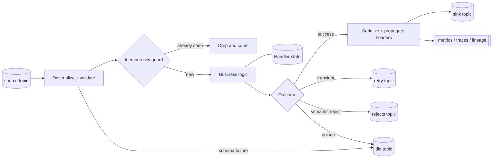
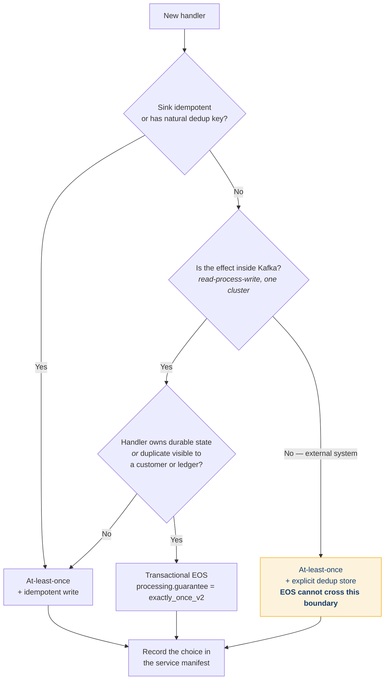
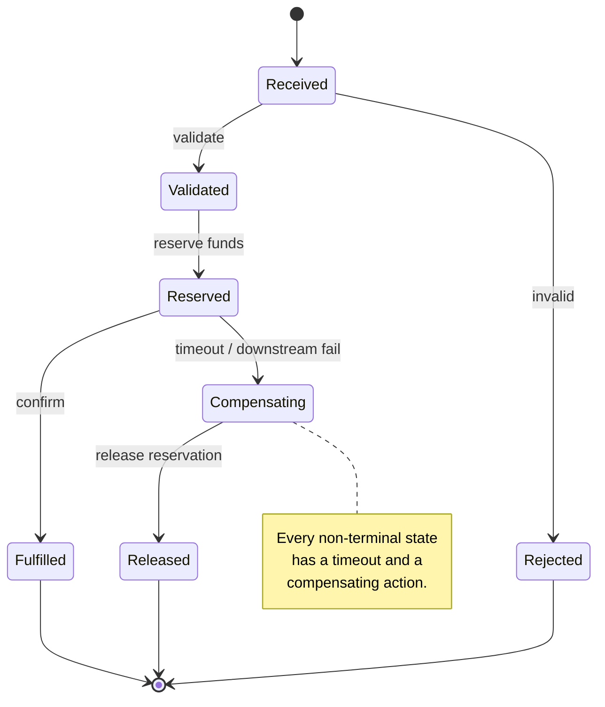
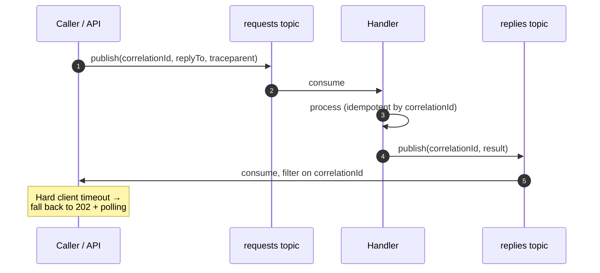
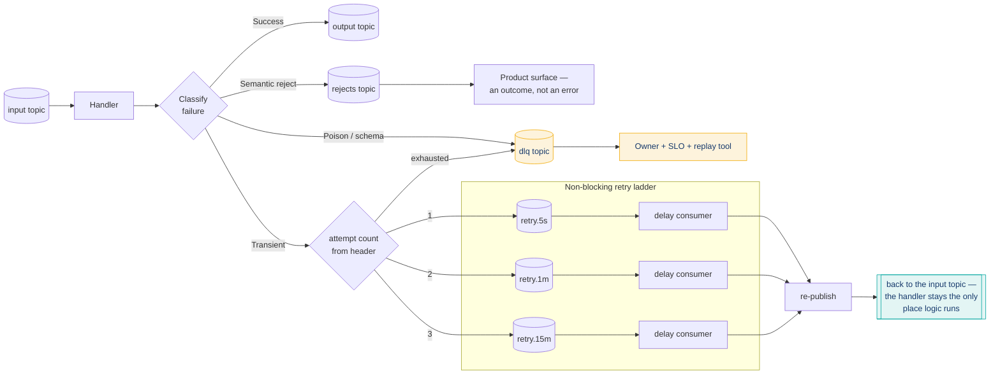
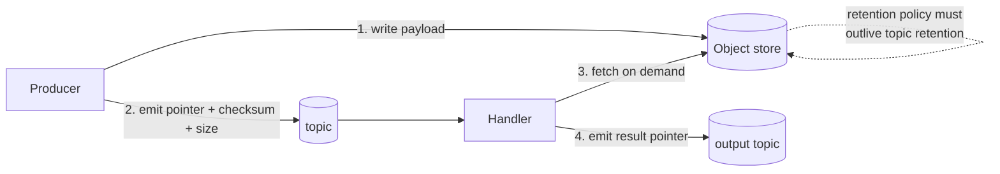
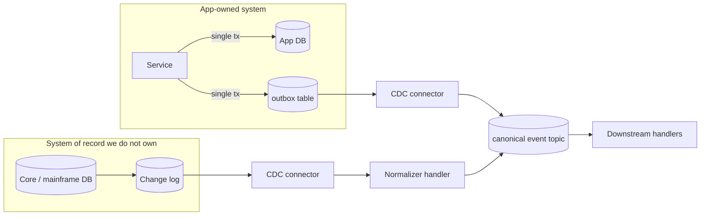
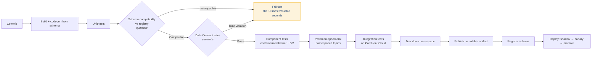
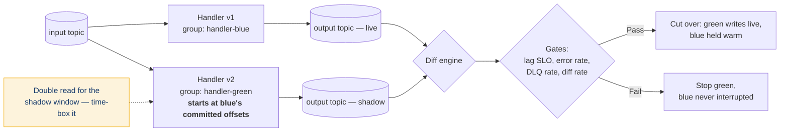
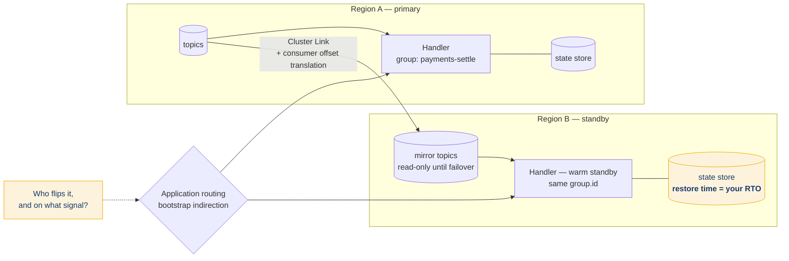

# Event Handler Design Patterns on Confluent Cloud — Revised Outline

**What changed from v1.0.** Base structure, act breaks, and slide voice are unchanged. Edits
marked **⟡** below. Summary:

| # | Change | Where |
|---|---|---|
| 1 | S2 listed four failures under a "six" header — now six, and the two additions pay off S16/S10 | S2 |
| 2 | Share groups added as the fifth substrate (GA on CC, AK 4.2.0 Feb 2026) | S3, S4/ART-1, ART-3 |
| 3 | Scope contradiction resolved — connectors are ingress/egress, not handlers | S3 |
| 4 | EOS boundary stated explicitly; ART-3 had a logic bug on external sinks | S7, ART-3 |
| 5 | **New slide** — what the ART-1 diagonal actually costs on CC | S12 |
| 6 | Free DLQ rungs named (managed sink connectors, Flink `error-handling.mode`) | S15 |
| 7 | Static membership / rebalance design fix added — S2 raised it, nothing answered it | S20 |
| 8 | Topic naming aligned to the CI-enforced wiki canon (ordering was wrong) | S20 |
| 9 | Test pyramid reconciled — slide now matches ART-9's five tiers and ordering | S21 |
| 10 | Schema gate qualified: it catches syntax, not meaning — S2's failure #4 needs Data Contract rules | S25, ART-11 |
| 11 | Blue/green offset-start and double-read cost added | S26, ART-12 |
| 12 | **New slide** — handler-side DR; v1.0 had none | S29 |
| 13 | Lag derivative over absolute lag | S28 |
| 14 | ART-6 rewired — retries never re-entered the handler | ART-6 |
| 15 | Slide count 29 → 31; timing restated honestly | header |

**Timing.** 31 slides presented properly is 40–46 min. Treat Q&A as separate, not inside the
35. The 20-minute cut is at the end of this file.

---

# Act 0 — Frame (S1–S4)

## S1 · Title
Title, subtitle, GoodLabs mark, "v1.0 — Practice Playbook."

## S2 · We keep paying for the same six failures ⟡
*The bugs aren't novel. They're the same six, in different clothes.*

- Poison pill takes down a partition at 2am; no one owns the DLQ.
- Handler is "exactly once" in the deck and at-least-once in production.
- Rebalance storm on every deploy because nobody set static membership.
- Schema change ships fine, breaks the consumer three teams downstream.
- ⟡ A replay you needed became an incident, because nothing was idempotent.
- ⟡ A rolling restart took forty minutes, because nobody sized the state.

> ⟡ Each of the six is now answered by a specific slide — say so on this slide, it earns
> attention for the rest of the deck: DLQ → S15 · EOS → S7 · rebalance → S20 · schema → S6+S25 ·
> replay → S16 · state → S10.

## S3 · What we mean by "event handler" ⟡
*A handler is the smallest unit of business logic with a topic on either side.*

- Scope: consume → decide → produce.
- ⟡ **Connectors are in scope as ingress and egress, out of scope as handlers.** (v1.0 said
  "not the connector" and then listed Connect as a substrate. This is the resolution — Connect
  moves data across the boundary; it is not where business logic lives.)
- ⟡ **Five substrates on Confluent Cloud**, not four:

| Substrate | Use it for | Disqualifier |
|---|---|---|
| Flink SQL / Table API | Stateless and windowed logic expressible declaratively; serverless | Logic that isn't expressible in SQL |
| Kafka Streams | Stateful JVM logic, EOS v2, embedded state stores | Team doesn't want to operate a JVM service |
| Consumer / producer client | Full control, non-JVM languages, custom effects | You are reimplementing Streams |
| ⟡ Share group worker (KIP-932) | Competing consumers, per-record ack, parallelism **above** partition count | Per-key ordering or EOS required — neither is available |
| Connect + SMT | Ingress/egress only | Any real business decision |

- Substrate choice is a pattern decision, not a language preference.

> **Speaker notes — the five questions that pick the substrate:**
> (1) Does it need state across events? (2) Does it need exactly-once? (3) Does per-key order
> matter? (4) Who operates it — app team or platform? (5) Is the effect inside Kafka or on an
> external system?

> ⟡ **Share groups, stated once, properly.** GA on Confluent Cloud; Apache Kafka 4.2.0,
> Feb 2026. Records are individually acknowledged rather than tracked by committed offset, so
> consumer parallelism decouples from partition count and a slow record stops blocking its
> partition. Cost: **at-least-once only, and per-key ordering is not preserved.** It is a
> work-distribution substrate, not a state-machine substrate.
> Backing: `wiki/concepts/queues-for-kafka-share-groups.md` (confidence: high, MCP-validated
> 2026-06-09).

## S4 · The catalog at a glance ⟡
*⟡ Fourteen patterns, two axes: how much state, how many streams.* → **[ART-1]**

- Positions every pattern in Acts 2–3 on one grid so the audience has a map.
- Call out the diagonal: state × join complexity is where your ops cost lives.
- ⟡ The diagonal is now priced on S12. Say "we'll come back to this" here.

---

# Act 1 — Anatomy & Contracts (S5–S8)

## S5 · Reference anatomy
*Every handler we build has the same nine parts. If yours is missing three, that's the finding.*
→ **[ART-2]**

- Deserialize/validate → idempotency guard → logic → state → serialize → emit → DLQ → metrics →
  trace propagation.
- The template repo enforces this shape. Deviations require an ADR.

## S6 · Contract first: schema, key, partition
*Ordering is a key-design decision made months before the incident.*

- Schema Registry as the gate: compatibility mode per topic, declared in git, checked in CI.
- Data Contracts (rules + migration rules) push validation left of the handler.
- Key = ordering domain. Choose it for the aggregate, not for the even spread.
- ⟡ Flag forward to S25: **the compatibility check is syntactic.** Data Contract *rules* are
  what carry semantics. This slide is where the real fix for S2's failure #4 lives.

Backing: `wiki/concepts/schema-registry-best-practices.md`,
`wiki/patterns/schema-registry-adoption-playbook.md`

## S7 · Delivery semantics: pick deliberately ⟡
*At-least-once plus an idempotent sink beats EOS for most handlers — and costs less.*
→ **[ART-3]**, **[ART-14]**

- Decision tree: is the sink idempotent? is there a natural dedup key? does the handler own state?
- EOS is a latency and throughput tax. Pay it where money moves, not everywhere.
- ⟡ **Say this out loud — it is S2's failure #2 in one sentence:** *transactional EOS ends at the
  cluster boundary. Any effect on an external system is at-least-once, always, no matter what
  `processing.guarantee` says.* Everyone nods at the tree; this is the line they remember.
- Document the choice per handler in the service manifest.

Backing: `wiki/concepts/exactly-once-semantics.md`, `wiki/patterns/fsi-exactly-once.md`

## S8 · Time semantics
*Processing time is a bug you haven't noticed yet.*

- Event time + watermarks; declare lateness policy explicitly.
- Where late data goes: side output, correction event, or dropped-and-counted. Never silent.
- Flink watermark strategy vs. Kafka Streams grace period — same concept, different knobs.

---

# Act 2 — Structural Patterns (S9–S14)

## S9 · Stateless: transform, filter, route
*If it's stateless and single-stream, it should be Flink SQL and it should be boring.*

- Content-based router, splitter, normalizer, masking/tokenization at the edge.
- Anti-pattern: a JVM microservice doing a three-line projection.

Backing: `wiki/patterns/flink-event-routing.md`

## S10 · Stateful: aggregate & window
*State is the thing you have to migrate, back up, and reason about at 3am.*

- Tumbling / hopping / session; retention vs. grace vs. TTL.
- Sizing state is a capacity planning exercise you do before you write the SQL.
- ⟡ Pays off S2's sixth failure: **restore time is your real deploy time and your real RTO.**
  Standby replicas trade cost for restore; decide deliberately, and measure it in S23.

Backing: `wiki/concepts/kafka-streams-production-hardening.md`, `wiki/concepts/flink-checkpointing.md`

## S11 · Enrichment & joins
*Three ways to enrich, and only one of them is free.*

- Stream–table (KTable / Flink lookup on a compacted topic) — preferred.
- Temporal / versioned join for point-in-time correctness (pricing, FX, entitlements).
- External lookup with a bounded cache — the escape hatch. Circuit-break it or it becomes your SLO.

## S12 · ⟡ NEW — What the diagonal costs
*ART-1 promised that operational cost rises along the diagonal. Here's the bill.* → **[ART-15]**

- Four levers, and they're the only four: **partition count** (sets your parallelism floor and
  your rebalance cost), **state size** (drives compute, restore time, and changelog storage),
  **retention** (storage, and how far back you can replay), **egress** (cross-AZ, cross-region,
  cross-cluster).
- Where each pattern lands: stateless Flink SQL is the cheapest thing you can run — cost is
  parallelism × throughput and nothing else. Windowed aggregates add state. Temporal joins hold
  *both* sides in state. Saga adds state plus timers plus a compensating path you also pay for.
- The trap: a handler is cheap to write and expensive to hold. Cost accrues at rest, not at
  authoring time.
- **Action:** price your top three handlers against these four levers before the next planning
  cycle. Not a number on a slide — an exercise you assign.

> Deliberately no dollar figures on the slide. Rates change; the four levers don't.

## S13 · Orchestration: saga / process manager
*Multi-step business processes need an explicit state machine, not a chain of handlers.*
→ **[ART-4]**

- Compensating actions, timeouts, terminal states.
- The state machine is a first-class artifact and it gets its own tests.

## S14 · Request–reply over Kafka
*Legal, useful, and usually the wrong instinct — but codify it so it's done once, well.*
→ **[ART-5]**

- Correlation ID, reply-to header, consumer-side filtering, hard client timeout.
- Prefer 202 + polling / server-sent completion over holding an HTTP thread.

---

# Act 3 — Resilience Patterns (S15–S18)

## S15 · Error taxonomy & the retry ladder ⟡
*Three error classes, three destinations. Everything else is guessing.* → **[ART-6]**

- Transient → tiered retry topics (5s / 1m / 15m), attempt count in headers.
- Poison / schema → DLQ with full original bytes + failure context.
- Semantic reject → business rejects topic. It's a product outcome, not an error.
- DLQ has an owner, an SLO, and a replay tool. Otherwise it's a landfill.
- ⟡ **Know which rungs you get for free before you build a ladder:** managed sink connectors
  auto-generate a DLQ topic, and Confluent Cloud for Apache Flink routes source deserialization
  failures to a DLQ table via the `error-handling.mode` table property. Hand-roll only what
  those two don't cover.

Backing: `wiki/patterns/dead-letter-queue-design.md`

## S16 · Idempotency & dedup
*Design the handler so replaying the topic is a non-event.*

- Natural business key > synthetic event ID > hash of payload.
- Dedup window sized to your worst-case replay, not your happy path.
- ⟡ Pays off S2's fifth failure. Name it: *"this is the slide that turns a replay from an
  incident into a Tuesday."*

## S17 · Claim check for large payloads
*Kafka is not a file system. Put the pointer on the topic.* → **[ART-7]**

- Payload to object store, reference + checksum + retention policy on the event.
- Governs blast radius on both throughput and cost.

> ⟡ **Open item — pin the number before this ships.** The slide is much stronger with the actual
> max message size next to it, per cluster type. I could not confirm it via `confluent-docs` in
> this pass (the Cloud quotas page doesn't carry it). Get it from the cluster-type limits page or
> the CC console for your target tier, then state it on the slide.

## S18 · Outbox & CDC ingress
*Dual writes are the most common correctness bug in event-driven systems.* → **[ART-8]**

- Transactional outbox for app-owned data; CDC for systems you don't control.
- Both converge on the same handler contract downstream.

---

# Act 4 — Development (S19–S20)

## S19 · The golden path
*A new handler should be running against a real topic in under an hour.*

- Template repo: anatomy from S5 pre-wired, plus test harness, CI, Terraform stanza, dashboards.
- Local loop: containerized broker + Schema Registry for the inner loop; ephemeral namespaced
  topics on a dev cluster for the outer loop.
- Codegen from schema — never hand-write the POJO.

## S20 · Config, identity, naming ⟡
*Nothing about environment lives in the artifact.*

- ⟡ **Topic naming convention: `{domain}.{application}.{version}.{entity}`** — enforced in CI,
  not in a wiki. Version sits *before* entity deliberately: it keeps prefix-based RBAC
  (`corebanking.*`) stable across a versioned migration, and it makes dual-version operation
  discoverable. Example: `corebanking.payments.v1.transaction`.
  *(v1.0's outline had `<domain>.<entity>.<type>.<version>` — wrong ordering. This is the
  ordering with Terraform variable validation and a CI pre-check behind it. See
  `wiki/patterns/topic-naming.md:22`.)*
- Service accounts per handler, RBAC scoped to the topics it actually touches, keys rotated by
  pipeline.
- Zero bootstrap URLs in code. Ever.
- ⟡ **Static membership — this is where S2's third failure gets answered.** `group.instance.id`
  set per instance, cooperative-sticky assignor, session timeout tuned to your restart window.
  A rolling deploy should not trigger a full rebalance. S23 proves it; this slide designs it.

Backing: `wiki/patterns/topic-naming.md`, `wiki/concepts/consumer-group-rebalancing.md`,
`wiki/patterns/fsi-governance-automation.md`

> ⟡ **Repo action, separate from the deck:** the naming convention in the global
> `CLAUDE.md` Confluent Canon block reads `<domain>.<entity>.<event>`, which matches neither the
> wiki nor CI. Three orderings in three places. Correct the canon block to match
> `wiki/patterns/topic-naming.md`.

---

# Act 5 — Testing (S21–S23)

## S21 · The streaming test pyramid ⟡
*Most streaming teams have an hourglass. We want a pyramid.* → **[ART-9]**

⟡ Five tiers, in the order they run — slide now matches the art:

1. **Unit** — topology test driver / Flink table tests. Thousands, milliseconds.
2. **Contract** — schema compatibility check as a build gate. Runs on every commit.
3. **Component** — containerized broker + Schema Registry, one handler, real serialization.
4. **Integration** — ephemeral namespaced topics on a real Confluent Cloud environment.
5. **Non-functional** — lag, rebalance, failover, poison pill. Nightly / pre-release.

*(v1.0's slide listed four tiers with Contract in fourth position; the art had five with Contract
second. The art was right — the contract gate is the cheapest thing in the stack and belongs
early.)*

## S22 · Determinism & fixtures
*A flaky streaming test is usually an undeclared time dependency.*

- Pin the clock, drive watermarks manually, seed everything.
- Fixtures from captured production traffic — masked, versioned, checked in.
- Golden-file assertions on output topics; diff, don't eyeball.

## S23 · The tests nobody writes
*Correctness tests pass. Then you deploy.*

- Lag & backpressure under 3× peak.
- Rebalance behavior on rolling restart. ⟡ *This is the test for the design decision on S20.*
- Broker/AZ failover and reconnect.
- Poison pill injection — prove the DLQ path actually works before prod proves it doesn't.
- ⟡ State restore time on a cold start — the number that sets your real RTO on S29.

---

# Act 6 — Deployment (S24–S27)

## S24 · Everything as code
*Clusters, topics, schemas, ACLs, connectors, Flink statements — all in git.* → **[ART-10]**

- Terraform Confluent provider as the single source of truth.
- Environment topology: separate CC environments per stage; Cluster Linking where prod data must
  reach lower stages (masked).

Backing: `wiki/patterns/terraform-cicd-confluent-private-networking.md`

## S25 · The pipeline ⟡
*The schema compatibility check is the most valuable ten seconds in CI.* → **[ART-11]**

- Build → unit → schema compat gate → component → integration on ephemeral topics → promote
  artifact.
- Same artifact through all stages. Config differs; bytes don't.
- ⟡ **And the honest caveat, on the same slide:** the compatibility check is **syntactic**. It
  will not catch a field reused with a new meaning, an enum value added that a consumer switches
  on, or a nullable field that consumers assumed was populated. All three pass `BACKWARD` and all
  three are how S2's failure #4 actually happens. What catches them: **Data Contract rules**
  (S6) and consumers declaring the subject *and version* they read.

> Why this matters for the deck's credibility: v1.0 promised on S2 that a downstream break is a
> solved problem and then offered a gate that doesn't solve it. Naming the limit is stronger than
> overclaiming, and it's what makes the Data Contracts material on S6 land.

## S26 · Blue/green, shadow, canary — for consumers ⟡
*You can't canary by percentage of traffic. You canary by consumer group.* → **[ART-12]**

- Shadow: new version, new group, same input, output to a shadow topic. Diff the two.
- Blue/green: new group reads from a chosen offset, cut over, keep blue warm.
- ⟡ **Two operational details that decide whether this works:**
  - Green starts at **blue's committed offsets**, not `earliest`. Starting at earliest replays
    history through a handler whose effects may not be idempotent — you just tested S16 in prod.
  - Running both is a **double read**: double the consumer-side compute and egress for the
    duration of the shadow window. Budget it and time-box it; "leave it shadowing for a while"
    is how this pattern gets banned.
- Promotion gates: lag SLO, error rate, DLQ rate, output diff rate.

## S27 · Reprocessing, rollback, and what you can't undo
*Code rolls back. Emitted events and evolved schemas do not.*

- Reversible: config, code, consumer group offsets, scaling.
- Irreversible-ish: produced records, schema evolution, compacted state, downstream side effects.
- Design corrections as events. Have the replay runbook written before you need it.

> Keep this slide exactly as-is. It's the best one in the deck.

---

# Act 7 — Run & Adopt (S28–S31)

## S28 · Observability & SLOs ⟡
*Consumer lag is a symptom. End-to-end event latency is the SLO.*

- Four signals per handler: lag, e2e latency p99, error rate by class, DLQ depth.
- ⟡ **Alert on lag's derivative, not its absolute value.** Absolute lag tells you nothing without
  direction — 50k and falling is fine, 5k and climbing is an incident. Steady-state lag is a
  tuning signal; growing lag is a paging signal.
- `traceparent` propagated in headers through every hop — required by the template.
- Stream Lineage for the "what breaks if I change this" question.

Backing: `wiki/concepts/consumer-lag-monitoring.md`, `wiki/concepts/observability-metrics-mapping.md`,
`wiki/concepts/sla-tiers.md`

## S29 · ⟡ NEW — DR: the handler's half of the plan
*Cluster Linking moves the data. Something still has to move the consumers.* → **[ART-16]**

- Cluster Linking for CC↔CC: mirror only what you need,
  `auto.create.mirror.topics.enable = false` in production, consumer offsets translated onto the
  mirror.
- The part teams forget: **application routing.** Bootstrap indirection, and a decision made in
  advance about who flips it and on what signal.
- ⟡ **Your RTO is dominated by state restore, not by the link.** A stateless handler fails over
  in seconds. A handler with a large state store fails over in however long the restore takes —
  which is why standby replicas or a warm handler in region B is a *cost* decision made on S12,
  not an ops decision made during the incident.
- Test it. It belongs on S23's list.

Backing: `wiki/patterns/dr-cluster-linking.md`, `wiki/patterns/dr-application-routing.md`,
`wiki/patterns/dr-multi-region-cluster.md`

> Placement note: this sits after observability deliberately — DR is an operational posture, not
> a deployment step, and it lands better once the four signals on S28 are on the table.

## S30 · Maturity model
*Ad hoc → templated → governed → self-service.* → **[ART-13]**

- Where each team sits, and the one thing that moves them up a stage.

## S31 · Monday
*Three things, this week.*

- Adopt the template repo for the next handler — not a retrofit.
- Add the schema compat gate to one pipeline.
- Name a DLQ owner for the three highest-volume topics.

---
---

# Art Assets

**All sixteen assets are built and live in `event-handler-deck-art/svg/`.** Output is vector SVG,
so it scales into PowerPoint / Google Slides / Keynote without resampling and the text stays
selectable. Matching 1600×900 PNGs are in `png/` for quick reference — do not use them in the deck.

Ten assets are mermaid (source retained below, so they stay editable); six are hand-authored SVG.
Both halves share one palette so the deck reads as a single system.

| Asset | Slide | File | Source | Aspect | Status |
|---|---|---|---|---|---|
| ART-1 | S4 | `art-01-pattern-taxonomy.svg` | hand-authored | 16:9 | revised |
| ART-2 | S5 | `art-02-handler-anatomy.svg` | mermaid | wide | unchanged |
| ART-3 | S7 | `art-03-delivery-semantics.svg` | mermaid | **portrait** | bug fixed |
| ART-4 | S13 | `art-04-saga.svg` | mermaid | **portrait** | unchanged |
| ART-5 | S14 | `art-05-request-reply.svg` | mermaid | wide | unchanged |
| ART-6 | S15 | `art-06-retry-ladder.svg` | mermaid | **wide, short** | rewired |
| ART-7 | S17 | `art-07-claim-check.svg` | mermaid | wide | unchanged |
| ART-8 | S18 | `art-08-outbox-cdc.svg` | mermaid | wide | unchanged |
| ART-9 | S21 | `art-09-test-pyramid.svg` | hand-authored | 16:9 | revised |
| ART-10 | S24 | `art-10-environment-topology.svg` | hand-authored | 16:9 | unchanged |
| ART-11 | S25 | `art-11-cicd-schema-gate.svg` | mermaid | wide | revised |
| ART-12 | S26 | `art-12-blue-green.svg` | mermaid | wide | revised |
| ART-13 | S30 | `art-13-maturity-model.svg` | hand-authored | 16:9 | unchanged |
| ART-14 | S7 | `art-14-eos-boundary.svg` | hand-authored | 16:9 | **new** |
| ART-15 | S12 | `art-15-cost-diagonal.svg` | hand-authored | 16:9 | **new** |
| ART-16 | S29 | `art-16-handler-dr.svg` | mermaid | wide | **new** |

**Placement.** ART-3 and ART-4 are portrait — full slide or right-half column, never a wide
content block. ART-6 is wide and short: full slide width, about a third of the height.
Everything else is 16:9 or close.

**Palette.** `#173A6C` primary · `#0074E4` accent · `#00A6A0` secondary · `#F2A900` error paths
only · `#5A6572` neutral · surfaces `#EAF1FA` `#E3F5F4` `#F4F6F8`. Amber is deliberately rare —
the crossing arrow on ART-14 and the DLQ nodes depend on it not appearing anywhere decorative.

---

## [ART-1] Pattern taxonomy grid ⟡ revised
`svg/art-01-pattern-taxonomy.svg` · hand-authored · 16:9

2×2 matrix — X: single stream → multi-stream/joined, Y: stateless → stateful. Fourteen pattern
chips across the quadrants, with a faded cost diagonal running bottom-left to top-right and a
legend that hands off to ART-15.

> ⟡ Two chips added since v1.0. **Share-group worker** sits bottom-left in teal — it is the one
> chip on the grid that cannot move up or right (no state, no EOS, no key order), which is worth
> saying out loud when you walk the grid. **Outbox / CDC ingress** covers S18, which v1.0's twelve
> chips didn't represent.

---

## [ART-2] Handler reference anatomy
`svg/art-02-handler-anatomy.svg` · mermaid · wide



---

## [ART-3] Delivery semantics decision tree ⟡ bug fixed
`svg/art-03-delivery-semantics.svg` · mermaid · **portrait**

**Bug fixed:** v1.0's tree could route an *external* sink to Transactional EOS via the
`state? No → duplicate visible? Yes` path. EOS cannot cross the cluster boundary, so that branch
recommended something that doesn't work. The `Is the effect inside Kafka?` node now gates both
EOS terminals — which also puts S7's central lesson inside the art rather than only in the
speaker notes.



---

## [ART-4] Saga / process manager
`svg/art-04-saga.svg` · mermaid · **portrait**



---

## [ART-5] Request–reply over Kafka
`svg/art-05-request-reply.svg` · mermaid · wide



---

## [ART-6] Error taxonomy & retry ladder ⟡ rewired
`svg/art-06-retry-ladder.svg` · mermaid · **wide, short**

**Bug fixed:** in v1.0 the retry rungs flowed `retry topic → delay consumer → {retry succeeded?}`,
which implies the delay consumers execute business logic. They don't — a delay consumer waits and
re-publishes to the handler's input. Teams copy these diagrams, so the wiring matters. The ladder
is now a contained subgraph feeding a single re-publish node, drawn as a **return node rather than
a back-edge** so the diagram ranks left-to-right instead of putting the ladder first.



> Annotation for the slide: managed sink connectors give you the DLQ rung free; CC Flink gives
> you the deserialization-failure rung free via `error-handling.mode`. Build only the rest.

---

## [ART-7] Claim check
`svg/art-07-claim-check.svg` · mermaid · wide



---

## [ART-8] Outbox & CDC ingress
`svg/art-08-outbox-cdc.svg` · mermaid · wide



---

## [ART-9] Streaming test pyramid ⟡ revised
`svg/art-09-test-pyramid.svg` · hand-authored · 16:9

Five tiers bottom-to-top — Unit, Contract, Component, Integration, Non-functional — with a
cost/runtime gradient bar on the right and a ghosted hourglass labelled "what most teams actually
have," carrying a small rejection badge.

*(v1.0's slide copy listed four tiers with Contract fourth; the art had five with Contract second.
The art was right — the contract gate is the cheapest check in the stack — so S21's copy was
corrected to match rather than the other way round.)*

---

## [ART-10] Environment topology
`svg/art-10-environment-topology.svg` · hand-authored · 16:9

Three environment bands (DEV / STAGE / PROD), each holding a Kafka cluster, Schema Registry,
Flink compute pool and topic cylinders. A dashed Cluster Link arrow runs prod → stage labelled
"masked subset"; a CI/CD band across the top reads "same artifact, different config"; a full-width
Terraform bar underneath feeds all three. Private-networking lock glyph on PROD only.

---

## [ART-11] CI/CD with schema gate ⟡ revised
`svg/art-11-cicd-schema-gate.svg` · mermaid · wide



> ⟡ The second gate is the change. Compatibility is syntactic and always was; Data Contract rules
> are what carry meaning. Drawing them as two distinct gates is what makes S25's caveat visible
> rather than a verbal footnote.

---

## [ART-12] Shadow / blue-green consumer deploy ⟡ revised
`svg/art-12-blue-green.svg` · mermaid · wide



---

## [ART-13] Maturity model
`svg/art-13-maturity-model.svg` · hand-authored · 16:9

Four-segment chevron ribbon in progressively darker tints — Ad hoc, Templated, Governed,
Self-service — with a three-line caption under each and the annotation "One change moves a team up
one stage — pick it deliberately." Carries the five scorecard axes along the bottom, so S30 needs
no second graphic.

---

## [ART-14] The exactly-once boundary ⟡ NEW
`svg/art-14-eos-boundary.svg` · hand-authored · 16:9

A bold dashed transactional boundary containing input topic, handler hexagon, state store and
output topic. Outside it, an external-system cloud. A single thick amber arrow runs from the
handler out to the cloud, visibly crossing the boundary with a marker at the crossing point and
the label "at-least-once, always."

The boundary is the strongest element in the image on purpose, and that amber arrow is the only
amber in it. This is S2's failure #2 in one picture — pairs with ART-3 on S7.

---

## [ART-15] What the diagonal costs ⟡ NEW
`svg/art-15-cost-diagonal.svg` · hand-authored · 16:9

Reproduces ART-1's exact grid geometry with the pattern chips ghosted out, then overlays the
diagonal as a widening wedge carrying four markers: partitions, state size, retention, egress.
Captions at each end — "parallelism × throughput, and nothing else" at the narrow end, "state +
joins + timers + a compensating path you also pay for" at the wide end.

Deliberately no currency figures anywhere in the image. Rates change; the four levers don't.

---

## [ART-16] Handler-side DR ⟡ NEW
`svg/art-16-handler-dr.svg` · mermaid · wide



> The two amber elements are the two things teams don't plan: state restore time, and the human
> decision to route. The link itself is the easy part.

---

## Regenerating or restyling the art

```bash
cd event-handler-deck-art
bash build.sh            # all mermaid sources → svg/
node preview.mjs         # all svg → png, for review
node preview.mjs art-06  # just one
node contact-sheet.mjs   # rebuild the reviewable contact sheet
```

`build.sh` pulls `@mermaid-js/mermaid-cli@11` via `npx` and applies `mermaid-config.json`, which
holds the shared theme. The six hand-authored assets — ART-1, ART-9, ART-10, ART-13, ART-14,
ART-15 — are edited directly in `svg/` and are **not** touched by `build.sh`.

If the art needs to be rebuilt in another tool, the original Visio-style briefs that produced the
six hand-authored assets are preserved in `event-handler-deck-art/ART-BRIEFS.md`.

---

# Delivery notes

**The 20-minute cut (14 slides).** S2, S3, S5, S7, S10, S11, S15, S16, S20, S21, S25, S26, S27,
S31. That's the spine and it survives alone. Section dividers are cheap — drop them all.

**Rehearse these four.** S7 (EOS boundary), S15 (retry ladder), S25 (the syntactic caveat), S27
(what you can't undo). Every hard question in the room lands on one of them, and S25 is the one
where an experienced person in the audience will test whether you're overclaiming.

**FSI variant.** Add SLA-tier framing to S28 (sub-ms market data / <10ms risk / <100ms compliance
/ async reconciliation), make S7 explicitly about regulatory reporting, and promote S29 from one
slide to two — regulated clients will want the offset-translation detail.
Backing: `wiki/concepts/sla-tiers.md`, `wiki/patterns/fsi-exactly-once.md`.

**Open items before this ships as a written playbook.**

1. Pin the max message size per cluster type for S17 — unconfirmed via MCP in this pass.
2. `wiki/patterns/event-handler-testing-strategy.md` does not exist. Acts 5 is the least
   wiki-backed part of the deck; worth a `/wiki:ingest` pass before the playbook is written down.
3. Correct the topic-naming convention in the global `CLAUDE.md` Confluent Canon block to match
   `wiki/patterns/topic-naming.md` — currently three different orderings across canon, wiki, and
   the v1.0 deck.
