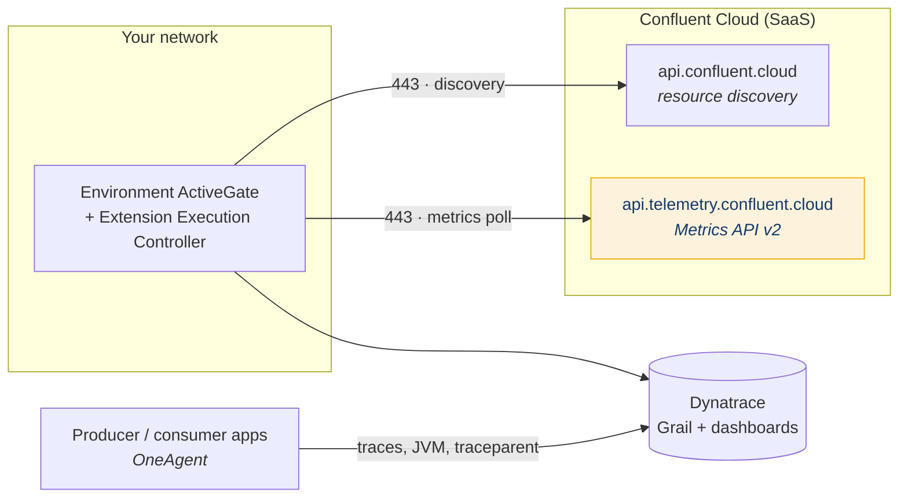

# Confluent Cloud → Dynatrace Metrics Integration

## Summary

Confluent Cloud telemetry reaches Dynatrace through a **pull-based extension running on an Environment ActiveGate**, authenticated with a Confluent Cloud API key that must be **resource-scoped for resource management** and bound to a service account holding the **`MetricsViewer`** role. OneAgent plays no part in collection — Confluent Cloud is SaaS and there is no host to instrument; OneAgent's role is the *other* half of the picture, instrumenting your own producer and consumer applications. The single most common failure is a network one: the extension talks to **two different Confluent hosts** — `api.confluent.cloud` for resource discovery and `api.telemetry.confluent.cloud` for the metrics themselves — and allowlisting only the first produces a configuration that looks entirely healthy and never delivers a datapoint. This article is the architecture and decision surface; the step-by-step procedure lives in `outputs/runbooks/cc-dynatrace-metrics-integration-runbook.md`.

> **Validation status (confidence: high).** Validated 2026-08-13 against `confluent-docs`: Metrics API host and endpoints, the resource-scoped-key requirement (Confluent states that *"API keys resource-scoped for Kafka clusters cause an authentication error"*), the `MetricsViewer` role binding on a service account, and the Dynatrace extension's prebuilt dashboard behaviour. **Not validated:** Metrics API rate limits, publication delay, ActiveGate minimum version, and the extension's exact emitted metric-key namespace — see Caveats.

## Pattern

### Architecture



Two things follow from this shape and both are load-bearing:

1. **The ActiveGate is the collector.** Sizing, placement, and egress are ActiveGate concerns. An ActiveGate without the Extension Execution Controller (EEC) will accept the monitoring configuration and never poll.
2. **The amber path is the one that gets missed.** Discovery and metrics are separate hosts, commonly on separate firewall rules.

### Why OneAgent is not the collector

Confluent Cloud is fully managed — there is no broker host to install an agent on. Teams with OneAgent already deployed reasonably assume it covers Kafka; it does not, and the assumption delays the integration.

The correct division:

| Concern | Collected by |
|---|---|
| Broker, connector, Schema Registry, Flink, ksqlDB, Cluster Link metrics | **ActiveGate extension** (this article) |
| Producer/consumer JVM and process metrics | OneAgent on the application host |
| Distributed traces and `traceparent` propagation through the handler | OneAgent on the application host |
| End-to-end latency (produce timestamp → downstream effect) | Both, correlated in the dashboard |

Both are needed for a complete picture. They meet in the dashboard, not in the collection path.

### The credential model

| Element | Requirement | Failure if wrong |
|---|---|---|
| Principal | A **service account**, dedicated to this integration | Shared/user keys break on staff change and fail attestation |
| Role | **`MetricsViewer`**, bound at organization or environment scope | `403` — key authenticates, authorization denied |
| API key scope | **Resource-scoped for resource management** (`--resource cloud`) | `401` — a Kafka-cluster-scoped key *will* fail against the Metrics API |

The `401`-vs-`403` split is diagnostic and worth memorising: **401 means the wrong kind of key, 403 means the missing role.** Teams routinely rotate a perfectly good key in response to a `401` that was actually a scope error.

`MetricsViewer` is read-only and grants no payload access. That is a useful thing to be able to state plainly in a control narrative.

### Feature sets

The extension groups metrics into feature sets; each carries polling cost, so enable against dashboards and alerts you actually have.

| Feature set | Enable when |
|---|---|
| Server Metrics | Always |
| Schema Registry Metrics | Always, where SR is in use |
| Connector Metrics | Managed connectors in use |
| Connector CDC Metrics (Postgres, MySQL, SQL Server, Oracle, MariaDB, DynamoDB) | CDC connectors in use — pairs with [Transactional Outbox and CDC Ingress](transactional-outbox.md) |
| Cluster Link Metrics | **Mandatory** where Cluster Linking is the DR path — see [DR Cluster Linking](dr-cluster-linking.md) |
| Flink Statement Metrics · Compute Pool Metrics | CC Flink in use |
| KSQL Metrics | ksqlDB in use |

### Metric naming — three conventions, easily confused

| Layer | Form | Example |
|---|---|---|
| CC Metrics API (native) | `io.confluent.<component>/<metric>` | `io.confluent.kafka.server/received_bytes` |
| Prometheus-flavoured (`/export`, Grafana) | all separators → `_` | `confluent_kafka_server_received_bytes` |
| Dynatrace DQL | underscored namespace, **dot** before the metric name | `confluent_kafka_server.received_bytes` |

**Discover the keys in-tenant rather than assuming them.** See Caveats — the extension's namespace is the least certain element of this pattern.

```dql
fetch metric.series
| filter matchesPhrase(metric.key, "confluent")
| summarize count(), by: { metric.key }
| sort `count()` desc
| limit 100
```

Per-metric semantics, directionality, and cross-provider query equivalents live in [Observability Metrics Mapping](../concepts/observability-metrics-mapping.md) and the glossaries in `outputs/reports/dynatrace-metrics-*`.

### Pull (extension) vs push (ingest API)

Two distinct integration models exist and they are frequently conflated:

| | **Pull — extension** (this article) | **Push — metrics ingest** |
|---|---|---|
| Mechanism | ActiveGate polls the CC Metrics API | Something posts to `{ENV_URL}/api/v2/metrics/ingest` |
| Auth | CC API key + `MetricsViewer` | Dynatrace API token, `metrics.ingest` scope |
| Fits | Confluent **Cloud** | Self-managed CP/CFK, or bridging JMX |
| Gains | Entity modelling, prebuilt dashboard | Full control of key namespace and cardinality |
| Costs | Extension version lag (see Caveats) | You build and own everything |

For the self-managed counterpart, see [CFK Observability Baseline](cfk-observability-baseline.md).

## When to Use

- Standing up observability for any Confluent Cloud estate where Dynatrace is the incumbent APM
- Consolidating Kafka telemetry into the same pane as application traces — the strongest argument for Dynatrace here is Davis AI correlation across Kafka, JVM, and downstream systems
- Replacing bespoke Metrics API scraping with a supported, vendor-maintained collector
- FSI contexts where a single vendor-supported observability contract is preferred over assembling a stack

Prefer the **push/ingest** model instead when the estate is primarily self-managed CP/CFK, or when you need control over metric key namespace and cardinality that a packaged extension does not give you.

## Caveats

- **⚠️ The extension's emitted metric-key namespace is unconfirmed.** The Dynatrace forms in [Observability Metrics Mapping](../concepts/observability-metrics-mapping.md) may describe the *push/ingest* path rather than the extension. Run the discovery query above before binding dashboards or alerts; this is the most likely place a Dynatrace-side assumption breaks.
- **Packaged integrations lag the Metrics API.** Confluent documents this explicitly for the Grafana integration — the default integration *"doesn't include metrics launched after the integration's own last update."* The same structural risk applies to the Dynatrace extension. A missing metric is often a version problem, not a configuration problem; the Prometheus `/export` endpoint is the stopgap.
- **Fully-managed connector *state* is not in the CC Metrics API.** Throughput yes, `RUNNING`/`FAILED` no. Connector state requires separate Connect REST API polling — see [Observability Metrics Mapping](../concepts/observability-metrics-mapping.md).
- **Two hosts, two firewall rules.** Allowlisting only `api.confluent.cloud` yields a healthy-looking configuration that never delivers data. Test both from the ActiveGate host, not from a laptop.
- **⚠️ Metrics API rate limits and cardinality caps are not asserted here.** They govern how short a polling interval is safe. Confirm for your org tier.
- **⚠️ Publication delay is real.** Confluent Cloud metrics are near-real-time, not real-time. Alert evaluation windows must accommodate it — measure the delay in your own tenant rather than assuming a value.
- **An empty dashboard and a broken dashboard look identical.** Verify via DQL, not by whether tiles render.
- **This is metrics, not audit.** A green metrics dashboard implies nothing about audit-log coverage, which is a separate pipeline with separate retention and regulatory weight — see [Audit Log SIEM Integration](audit-log-siem-integration.md).

## FSI Overlay

- **Service account per integration**, with owner and rotation date recorded at creation. This credential holds read access to operational telemetry across the organization and belongs in the same rotation and attestation cycle as any other production credential.
- **`MetricsViewer` carries no payload access.** State this explicitly in control narratives — it is the first question a reviewer asks, and the answer is clean. See [Auditor Read-Only RBAC and Payload Isolation](auditor-readonly-rbac-payload-isolation.md).
- **Prefer per-environment role bindings** where environments separate regulated from non-regulated workloads, so the credential's blast radius matches the data classification. Organization-scope binding is operationally simpler and correspondingly broader — a deliberate trade, not a default.
- **Store the key as a Dynatrace credential, not inline** in the monitoring configuration. Rotation then becomes a single edit rather than a rediscovery cycle.
- **Alert thresholds are tier-driven**, not global — see [SLA Tiers](../concepts/sla-tiers.md).
- **Cluster Link Metrics are mandatory where Cluster Linking is the DR path.** An unmonitored mirror lag is an unmeasured RPO.
- **Read-only and non-destructive throughout.** Nothing in this integration can affect cluster operation, which makes the change-approval conversation short.

## Related

- [Observability Metrics Mapping](../concepts/observability-metrics-mapping.md) — per-metric identity and cross-provider query equivalents
- [CFK Observability Baseline](cfk-observability-baseline.md) — the self-managed / Prometheus counterpart to this pattern
- [Consumer Lag Monitoring](../concepts/consumer-lag-monitoring.md) — alert on the derivative, not the absolute
- [Cluster Linking Observability](cluster-linking-observability.md) · [Schema Registry Observability](../concepts/schema-registry-observability.md) · [ksqlDB Observability](../concepts/ksqldb-observability.md)
- [Audit Log SIEM Integration](audit-log-siem-integration.md) — the separate, non-substitutable audit pipeline
- [Event Handler Testing Strategy](event-handler-testing-strategy.md) — the four signals these metrics feed

---

*Procedure: `outputs/runbooks/cc-dynatrace-metrics-integration-runbook.md` — preconditions, credential gate, verification, troubleshooting, rollback.*
