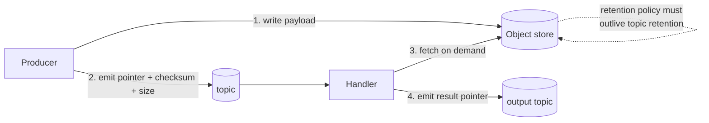

# Claim Check for Large Payloads

## Summary

Kafka is not a file system. When an event's payload is large — scanned documents, images, model artefacts, bulk extracts — the **claim check** pattern writes the payload to object storage and puts only a *reference* on the topic: a pointer, a checksum, and a size. Handlers fetch the payload on demand. This bounds broker memory, replication cost, and consumer fetch latency, and it keeps the topic's retention economics sane. The one rule that is easy to get backwards and expensive to discover: **the object store's retention must outlive the topic's retention**, or replay produces dangling pointers.

> **Validation status (confidence: medium).** The pattern is vendor-neutral and well established. The threshold at which it becomes necessary depends on the maximum message size for your cluster type — see Caveats; that value is **not** asserted here and must be confirmed per tier.

## Pattern



### The event body

The event on the topic carries a reference, not the payload:

| Field | Purpose |
|-------|---------|
| `uri` | Location in object storage — fully qualified, not relative |
| `checksum` | Integrity verification on fetch; also the natural dedup key |
| `size_bytes` | Lets a consumer decide whether it can handle this record before fetching |
| `content_type` | Avoids sniffing |
| `expires_at` | Makes the retention contract explicit in the payload |

The reference event is a normal schema-registered record and follows the usual [topic naming](topic-naming.md) and compatibility rules.

### Retention coupling — the load-bearing constraint

Two retention policies now govern one logical event:

```
topic retention:        ├──────────────┤
object store retention: ├──────────────────────────┤   ✅ correct

topic retention:        ├──────────────────────────┤
object store retention: ├──────────────┤               ❌ replay finds dangling pointers
```

If you replay a topic from `earliest` and the objects have been lifecycled away, the replay fails in a way that looks like a handler bug. Make the object-store lifecycle policy a reviewed artefact alongside the topic's `retention.ms`, and set it from the same Terraform module.

### Where the object store lives

Prefer the same cloud and region as the cluster. A cross-region fetch turns a cheap pointer into a per-record egress charge and a latency tail. For the archival-side relationship — long retention, compliance system of record — see [Archival Storage for Long-Retention Topics](archival-storage-long-retention-topics.md), which solves an adjacent but distinct problem.

## When to Use

- Payloads consistently large enough to distort batching, fetch latency, or replication cost
- Payloads whose size varies wildly, where the p99 record would otherwise size the whole pipeline
- Binary content — documents, images, audio — that has no business being schema-encoded
- Any case where the payload has a different retention or access-control requirement from the event

**Do not use it** for merely "biggish" JSON. The indirection has a real cost in complexity, failure modes, and an extra system in the fetch path. Compression, better modelling, or splitting the event usually beats a claim check below the genuine size threshold.

## Caveats

- **⚠️ Confirm your cluster's maximum message size before choosing a threshold.** This value varies by Confluent Cloud cluster type and was **not confirmable from the Cloud quotas documentation** during this article's drafting. Get it from the cluster-type limits page or the Console for your target tier and record it here. See [CC Cluster Tiers](../concepts/cc-cluster-tiers.md).
- **The object store becomes a hard dependency of the handler.** Its availability is now your availability; its throttling is now your backpressure. Instrument the fetch path and circuit-break it.
- **Two-phase failure.** The payload write and the event emit are not atomic. Write the payload *first*, then emit — an orphaned object is garbage; an event pointing at a missing object is an incident. Lifecycle policy cleans up the orphans.
- **DLQ interaction.** A DLQ'd claim-check event contains a pointer, not the data. Replay is only possible while the object still exists — another reason the retention coupling matters. See [Dead Letter Queue Design](dead-letter-queue-design.md).
- **Lineage and governance tools see the pointer, not the payload.** Stream Lineage will not show what is actually flowing. Tag accordingly.
- **The checksum is not optional.** Without it there is no way to detect a payload that was overwritten between emit and fetch.

## FSI Overlay

- **Access control must be equivalent on both sides.** A payload whose event is RBAC-restricted but whose object is broadly readable has moved the data out of the governed perimeter. The object-store ACL is part of the topic's security posture, not a separate concern.
- **Encryption at rest and in transit on the object store** is assumed, and the key management should match the cluster's — see the UKO key lifecycle discussion in [LinuxONE Platform Foundations](../concepts/linuxone-platform-foundations.md) for the regulated-key model.
- **Retention is a compliance artefact.** Where the event is a regulatory record, the object *is* the record. The lifecycle policy needs the same sign-off as the topic retention, and deleting the object early is a records-management failure, not a cost optimisation.
- **PII in payloads is invisible to schema-level tagging.** Field-level classification and CSFLE operate on the event, which contains only a pointer. Classify at the object level explicitly — see [Schema Inference and PII Categorization](../concepts/schema-inference-and-pii-categorization.md).

## Related

- [Archival Storage for Long-Retention Topics](archival-storage-long-retention-topics.md) — adjacent pattern; retention rather than payload size
- [Event Handler Substrate Selection](event-handler-substrate-selection.md) — the fetch is an external effect, which constrains delivery semantics
- [Dead Letter Queue Design](dead-letter-queue-design.md) — DLQ'd pointers are only replayable while the object lives
- [Producer Batching Configuration](../concepts/producer-batching-config.md) — what large records do to batching
- [CC Cluster Tiers](../concepts/cc-cluster-tiers.md) — where per-tier limits live

---

*Diagram source: `outputs/reports/event-handler-deck-art/svg/art-07-claim-check.svg`.*
