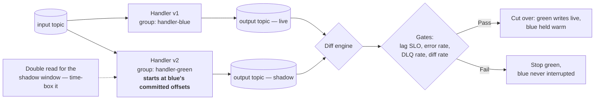

# Consumer Deployment Strategies

## Summary

You cannot canary a Kafka consumer by percentage of traffic — there is no load balancer in the path. **You canary by consumer group.** This article covers the three deployment strategies available to an event handler (rolling, blue/green group, and Flink statement swap), the shadow-and-diff technique that makes a semantic change safe to ship, and the two operational details that decide whether blue/green actually works: green must start from **blue's committed offsets**, not `earliest`, and running both is a **double read** that must be time-boxed. A consumer group is a stateful deployment; treating it like a stateless web service is how rebalance storms and accidental production replays happen.

> **Validation status (confidence: medium).** Built on the rebalancing protocol and static-membership behaviour documented in [Consumer Group Rebalancing](../concepts/consumer-group-rebalancing.md) (MCP-validated) and Flink statement immutability in [Flink on Confluent Cloud](../concepts/flink-confluent-cloud-setup.md). The blue/green and shadow-diff procedures are field practice, not a vendor-published runbook.

## Pattern

### Choosing a strategy

| Strategy | Use when | Key risk |
|----------|----------|----------|
| **Rolling** | Default. Handler behaviour is unchanged — bug fix, dependency bump, config tweak | Rebalance on every instance replacement if static membership is not configured |
| **Blue/green group** | **Any change to handler semantics** — output shape, business rule, state layout | Offset start point; double-read cost |
| **Flink statement swap** | Flink handlers — statements are immutable, so "update" is always a replace | Downstream consumers must be repointed |

### Rolling — and the precondition everyone skips

A rolling deploy is only safe when a replaced instance does **not** trigger a full group rebalance. That requires:

- `group.instance.id` set per instance (static membership, KIP-345)
- Cooperative-sticky partition assignor
- `session.timeout.ms` tuned to exceed the instance restart window

Without these, every deploy is a rebalance storm: partitions revoked across the whole group, state stores re-initialised, and lag spiking on instances that were never replaced. See [Consumer Group Rebalancing](../concepts/consumer-group-rebalancing.md) for the protocol detail and [Consumer Config (FSI)](consumer-config-fsi.md) for the baseline values.

**This is a design decision, not an ops one.** [Event Handler Testing Strategy](event-handler-testing-strategy.md) tier 5 is where you prove it.

### Blue/green group with shadow-and-diff

The safe path for a semantic change. Blue keeps serving; green proves itself against the same input.

**Procedure:**

1. Deploy v2 under a **new `group.id`**, writing to a **shadow output topic**.
2. Start green at **blue's committed offsets** (see below).
3. Run both for a bounded window. Diff the two output topics programmatically.
4. Evaluate the promotion gates: lag SLO, error rate by class, DLQ rate, output diff rate.
5. On pass — repoint green at the live output topic, stop blue, retain blue's group for the rollback window.
6. On fail — stop green. Blue was never interrupted.

### The two details that decide whether this works

**1. Green starts at blue's committed offsets — not `earliest`.**

Starting green at `earliest` replays the entire retained history through a handler whose effects may not be idempotent. If the handler calls an external system, that is a production incident dressed as a deployment. Read blue's committed offsets and seed green's group with them explicitly.

Where a full replay *is* the intent — a backfill, a corrected computation — that is a reprocessing operation with its own runbook and downstream coordination, not a deployment.

**2. Running both is a double read.**

Two groups consuming the same topic is double the consumer-side compute and double the egress for the whole shadow window. That is a real, metered cost. Budget it, and **time-box the window** — "leave it shadowing for a while" is how this pattern gets banned by whoever owns the bill.

### Flink statement swap

Confluent Cloud Flink statements are immutable — there is no in-place edit. The equivalent of blue/green is:

1. Create the new statement writing to a **new derived topic**
2. Verify output against the existing derived topic
3. Repoint downstream consumers
4. Drop the old statement

This is the [raw → derived](flink-event-routing.md) topology paying off: because consumers read derived topics rather than the raw stream, the routing logic can be replaced without touching producers. See [Flink on Confluent Cloud](../concepts/flink-confluent-cloud-setup.md) for statement lifecycle and state-carry-over constraints.

### Offset reset policy

**Decided before deploy, written down, and not improvised during an incident.** For each handler, record:

- The default `auto.offset.reset` and why (`earliest` unless deliberately justified)
- What a replay means downstream — which systems must be paused, how duplicates are absorbed
- Who authorises a replay

### What rolls back and what does not

| Reversible | Irreversible-ish |
|------------|------------------|
| Config | Produced records |
| Code / artifact version | Schema evolution |
| Consumer group offsets | Compacted state (originals gone) |
| Scaling | Downstream side effects |

**Design corrections as events.** You do not un-emit a record; you emit a correction, and downstream handlers must be built to accept one.

## When to Use

- Shipping any change to handler semantics — output shape, business rule, state layout
- Standing up the deployment stage of a golden-path CI/CD template
- Diagnosing lag spikes or rebalance storms that correlate with deploy times
- Planning a reprocessing or backfill operation (the offset discipline is the same)

## Caveats

- **Shadow-and-diff needs a diff that means something.** Non-deterministic output — wall-clock timestamps, random IDs, unordered aggregation — makes the diff meaningless. Fix determinism first; see [Event Handler Testing Strategy](event-handler-testing-strategy.md).
- **Blue/green does not help when the *input* schema changes.** That is a contract problem handled at the registry, not a deployment problem.
- **Two groups double the read, not the write.** The shadow topic is additional storage, but the dominant cost is usually consumer compute and egress.
- **Retaining blue "warm" has a cost too.** Decide the rollback window explicitly and enforce it.
- **Static membership trades rebalance avoidance for failure-detection latency.** A genuinely dead instance is not reassigned until `session.timeout.ms` expires. Tune deliberately.
- **Share group workers have no committed offsets to seed from** — acknowledgement is per record, not positional. The blue/green procedure here assumes a classic consumer group. See [Queues for Kafka](../concepts/queues-for-kafka-share-groups.md).

## FSI Overlay

- **Blue/green is the default for anything touching a ledger or a regulatory report**, not the exception. A semantic change shipped by rolling deploy has no verification step and no clean rollback.
- **The diff is evidence.** Retain the shadow-window diff result as a change-management artifact — it demonstrates the new version was verified against production traffic before promotion. Maps to the CI/CD audit trail in [FSI Compliance](../concepts/fsi-compliance.md).
- **Replay authorisation belongs in the runbook with a named approver.** An unplanned `earliest` reset against a payments handler is a reportable event, not a mistake.
- **Never reuse a `group.id` across environments.** Group names are part of the RBAC surface — see the service-account-per-handler rule in [FSI Governance Automation](fsi-governance-automation.md).
- **DR cutover is a different operation from deployment** and uses different machinery — see [DR Application Routing](dr-application-routing.md). Do not conflate a blue/green deploy with a regional failover.

## Related

- [Consumer Group Rebalancing](../concepts/consumer-group-rebalancing.md) — static membership and assignor behaviour
- [Consumer Config (FSI)](consumer-config-fsi.md) — baseline values
- [Event Handler Testing Strategy](event-handler-testing-strategy.md) — tier 5 proves the rolling-restart precondition
- [Flink Event Routing](flink-event-routing.md) — why derived topics make statement swap safe
- [DR Application Routing](dr-application-routing.md) — failover, which is not deployment
- [Consumer Lag Monitoring](../concepts/consumer-lag-monitoring.md) — the promotion gate signals

---

*Diagram source: `outputs/reports/event-handler-deck-art/svg/art-12-blue-green.svg`.*
