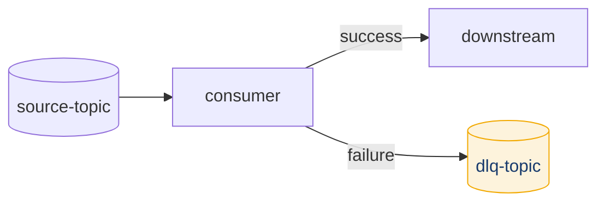
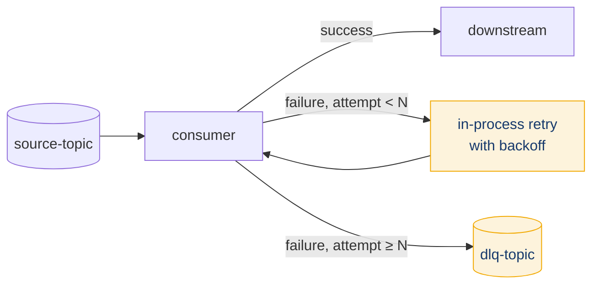
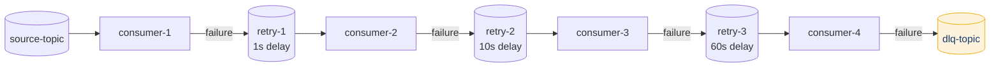
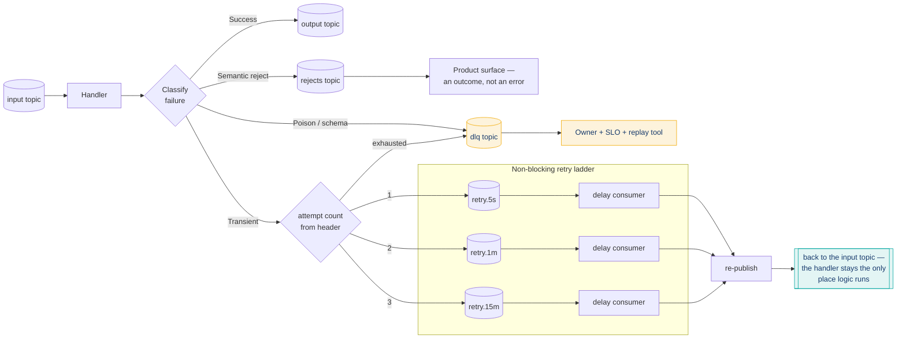

# Dead Letter Queue Design

## Summary

A Dead Letter Queue (DLQ) is a dedicated Kafka topic where messages that cannot be successfully processed are routed, preserving the original payload with error context metadata for later diagnosis and replay. Open-source Apache Kafka has no native DLQ *broker* primitive -- at the client level, every DLQ is application-level (manual consumer code, Kafka Streams exception handlers) or framework-level (Kafka Connect's built-in DLQ, Spring Kafka's `DeadLetterPublishingRecoverer`). On Confluent Cloud, two managed layers now provide DLQ natively: **managed sink connectors** auto-generate a DLQ topic, and **Confluent Cloud for Apache Flink** routes source deserialization errors to a DLQ table via the `error-handling.mode` table property. The core trade-off is between pipeline continuity (skip failures, keep processing) and data completeness (no message silently dropped), with pattern complexity scaling from a simple single-topic DLQ to multi-level non-blocking retry topologies.

## Pattern

### Architecture Variants

Four DLQ patterns exist, each adding capability at the cost of operational complexity:

| Pattern | Topology | Retry Behavior | Best For |
|---------|----------|----------------|----------|
| Simple DLQ | `source -> consumer -> dlq` | None -- immediate route on first failure | Low-volume, non-retriable errors (schema violations) |
| Retry + DLQ | `source -> consumer (N retries) -> dlq` | In-process blocking retries with backoff | Simple apps with occasional transient failures |
| Multi-Level DLQ | `source -> retry-1 -> retry-2 -> ... -> dlq` | Non-blocking via separate retry topics | High-throughput systems (Uber pattern) |
| Error Categorization | Classify exception, then route | Retriable -> retry topics; non-retriable -> DLQ | Production systems requiring efficient failure routing |

#### Simple DLQ



Failed messages go directly to a single DLQ topic with no retries. Appropriate when failures are rare and expected to be permanent (corrupt payloads, schema violations). Trade-off: conflates transient and permanent failures in the same topic.

#### Retry + DLQ



Consumer retries N times (typically 3-5) with exponential backoff before routing to DLQ. Drawback: **blocking retries** prevent the consumer from processing subsequent messages on that partition during backoff, creating head-of-line blocking at scale.

#### Multi-Level DLQ (Non-Blocking Retry Topics)



Each retry level is a separate Kafka topic with its own consumer group. Delay is enforced by the retry-level consumer checking a "not-before" timestamp header and pausing partition consumption until the delay elapses. The main consumer continues processing immediately -- no head-of-line blocking. This is the [Uber Engineering pattern](https://www.uber.com/us/en/blog/reliable-reprocessing/) and the recommended approach for high-throughput systems.

Spring Kafka's `@RetryableTopic` automates this pattern, creating topics like `orders.placed-retry-1000`, `orders.placed-retry-2000`, `orders.placed-dlt`.

#### Error Categorization



The consumer classifies before routing. **Three classes, three destinations** — everything else is guessing:

| Class | Meaning | Exception / signal types | Destination | Owner |
|-------|---------|--------------------------|-------------|-------|
| **Transient** | Will probably succeed later | `ConnectException`, `TimeoutException`, `RetriableException`, HTTP 5xx, throttling | Retry topics with backoff | Platform |
| **Poison / schema** | Will never succeed | `SerializationException`, `DeserializationException`, `JsonParseException`, contract violations | DLQ, immediately — skip retries | Platform + producing team |
| **Semantic reject** | Processed correctly; the answer is "no" | Failed a business rule — limit exceeded, ineligible account, duplicate submission | **Rejects topic** | **Product** |

This is the recommended production approach. Retrying a deserialization error is wasted effort; routing a transient timeout directly to DLQ loses recoverable messages.

> **The third class is the one teams miss.** A payment that fails a limit check is not an error — it is an *outcome*, and something downstream wants it: a customer notification, a case queue, an analytics feed. Routing it to the DLQ buries a product event in an operations channel where the only consumer is an on-call engineer wondering why the DLQ is full of things that worked correctly. Give business rejects their own topic, treat it as a product surface, and the DLQ goes back to meaning "something is broken."

**Delay consumers wait and re-publish to the handler's input topic — they do not execute business logic.** The handler stays the only place logic runs. A ladder where each rung re-implements processing is four copies of the same code drifting apart.

### Kafka Connect DLQ

Kafka Connect has built-in DLQ support via [KIP-298](https://cwiki.apache.org/confluence/display/KAFKA/KIP-298:+Error+Handling+in+Connect). This applies to **sink connectors only** -- source connector errors are handled at the task level (no per-record DLQ).

> **Confluent Cloud managed connectors:** for fully-managed sink connectors, Confluent Cloud auto-generates the DLQ topic (named `dlq-<connector-id>`) -- you do not set `errors.deadletterqueue.topic.name` yourself. Inspect failures in the Console under the connector's Dead Letter Queue view or by consuming the topic directly. See [View Errors in the Dead Letter Queue](https://docs.confluent.io/cloud/current/connectors/dead-letter-queue.html). The self-managed (Confluent Platform) configuration below applies to connectors you run yourself.

#### Configuration Reference

| Property | Default | Description |
|----------|---------|-------------|
| `errors.tolerance` | `none` | `none` = fail immediately; `all` = skip errors and continue. **Must be `all` to enable DLQ.** |
| `errors.deadletterqueue.topic.name` | `""` (empty) | Target topic for failed records. If empty with `errors.tolerance=all`, failed records are **silently dropped**. |
| `errors.deadletterqueue.topic.replication.factor` | `3` | Replication factor for auto-created DLQ topic. |
| `errors.deadletterqueue.context.headers.enable` | `false` | Adds error context headers to DLQ records. **Should always be `true` in production.** |
| `errors.retry.timeout` | `0` | Total time in ms for retries. `0` = no retries. `-1` = infinite retries. |
| `errors.retry.delay.max.ms` | `60000` | Maximum delay between retry attempts. Exponential backoff with jitter. |
| `errors.log.enable` | `false` | Log failed records. |
| `errors.log.include.messages` | `false` | Include record content in logs. **Caution: may log PII.** |

> `errors.retry.timeout` default is documented inconsistently across sources. Apache Kafka source code defines the default as `0` (no retries). Treat `0` as canonical.

#### Recommended Production Configuration

```properties
# Enable error tolerance -- required to activate DLQ
errors.tolerance=all

# DLQ topic -- use dlq.<connector-name> convention
errors.deadletterqueue.topic.name=dlq.jdbc-sink-orders
errors.deadletterqueue.topic.replication.factor=3

# Context headers -- always enable; without these you see failures but cannot diagnose them
errors.deadletterqueue.context.headers.enable=true

# Retry -- 5 minutes total with up to 60s between attempts
errors.retry.timeout=300000
errors.retry.delay.max.ms=60000

# Logging -- enable but do not log message content in production
errors.log.enable=true
errors.log.include.messages=false
```

#### Connect DLQ Context Headers

When `errors.deadletterqueue.context.headers.enable=true`, these headers are added:

| Header | Content |
|--------|---------|
| `__connect.errors.topic` | Original source topic |
| `__connect.errors.partition` | Original partition number |
| `__connect.errors.offset` | Original offset |
| `__connect.errors.connector.name` | Connector name |
| `__connect.errors.task.id` | Task ID that failed |
| `__connect.errors.stage` | Processing stage (`VALUE_CONVERTER`, `TRANSFORMATION`, `SINK_PUT`) |
| `__connect.errors.class.name` | Component class that failed |
| `__connect.errors.exception.class.name` | Exception class |
| `__connect.errors.exception.message` | Exception message |
| `__connect.errors.exception.stacktrace` | Full stack trace |

### Spring Kafka DLQ

#### Blocking Retries with `DefaultErrorHandler`

```java
@Bean
public DefaultErrorHandler errorHandler(KafkaTemplate<Object, Object> template) {
    DeadLetterPublishingRecoverer recoverer =
        new DeadLetterPublishingRecoverer(template,
            (record, ex) -> new TopicPartition(
                record.topic() + ".DLT", record.partition()));

    DefaultErrorHandler handler = new DefaultErrorHandler(
        recoverer,
        new FixedBackOff(1000L, 3L));  // 1s interval, 3 attempts

    // Non-retriable exceptions skip retries, go directly to DLT
    handler.addNotRetryableExceptions(
        DeserializationException.class,
        JsonParseException.class);

    return handler;
}
```

`DeadLetterPublishingRecoverer` automatically adds headers: `KafkaHeaders.DLT_ORIGINAL_TOPIC`, `DLT_ORIGINAL_PARTITION`, `DLT_ORIGINAL_OFFSET`, `DLT_ORIGINAL_TIMESTAMP`, `DLT_EXCEPTION_FQCN`, `DLT_EXCEPTION_MESSAGE`, `DLT_EXCEPTION_STACKTRACE`.

Default DLT topic naming: `<ORIGINAL_TOPIC>.DLT`.

#### Non-Blocking Retries with `@RetryableTopic`

```java
@RetryableTopic(
    attempts = "4",
    backoff = @Backoff(delay = 1000, multiplier = 2, maxDelay = 8000),
    include = {TransientException.class},
    exclude = {DeserializationException.class},
    dltStrategy = DltStrategy.FAIL_ON_ERROR,
    autoCreateTopics = "true"
)
@KafkaListener(topics = "orders.placed")
public void listen(ConsumerRecord<String, String> record) {
    processOrder(record);
}
```

Creates topics: `orders.placed-retry-1000`, `orders.placed-retry-2000`, `orders.placed-retry-4000`, `orders.placed-dlt`.

`DltStrategy` options:

| Strategy | Behavior |
|----------|----------|
| `ALWAYS_RETRY_ON_ERROR` | Retry DLT processing failures (default) |
| `FAIL_ON_ERROR` | Fail on DLT processing error |
| `NO_DLT` | No DLT topic; after retries exhausted, processing ends |

### Kafka Streams DLQ

Kafka Streams has no built-in DLQ mechanism. Three exception handler interfaces exist:

**`DeserializationExceptionHandler`** (read path, config: `default.deserialization.exception.handler`):

- `LogAndFailExceptionHandler` -- logs and stops the application. **This is the default.**
- `LogAndContinueExceptionHandler` -- logs and skips the record.
- Custom handler for DLQ routing:

```java
public class DlqDeserializationHandler implements DeserializationExceptionHandler {
    private KafkaProducer<byte[], byte[]> dlqProducer;
    private String dlqTopic;

    @Override
    public void configure(Map<String, ?> configs) {
        this.dlqProducer = (KafkaProducer<byte[], byte[]>) configs.get("dlq.producer");
        this.dlqTopic = (String) configs.get("dlq.topic");
    }

    @Override
    public DeserializationHandlerResponse handle(ProcessorContext context,
            ConsumerRecord<byte[], byte[]> record, Exception exception) {
        ProducerRecord<byte[], byte[]> dlqRecord =
            new ProducerRecord<>(dlqTopic, record.key(), record.value());
        dlqRecord.headers()
            .add("x-error-class", exception.getClass().getName().getBytes());
        dlqProducer.send(dlqRecord);
        return DeserializationHandlerResponse.CONTINUE;
    }
}
```

**`ProductionExceptionHandler`** (write path, config: `default.production.exception.handler`):
- Handles failures when Streams produces output records (serialization errors, broker write failures).
- Default: `DefaultProductionExceptionHandler` returns `FAIL`.
- Custom implementations can return `CONTINUE` to skip or route to DLQ.

**`ProcessingExceptionHandler`** (KIP-1033, Kafka 3.9+):
- Handles exceptions during record processing logic, filling the gap where processing errors previously required try/catch in processor code.
- Verify availability in your target Kafka version before relying on this.

### Confluent Cloud Flink DLQ

Unlike self-managed Kafka Streams, **Confluent Cloud for Apache Flink has a native, managed DLQ**. It is configured on the source *table* (not per statement or per job) via two table properties, and Flink auto-creates the DLQ topic and registers its schema.

**Scope -- this is the critical caveat:** the Flink DLQ captures **source deserialization errors only**. Errors in UDFs, serialization (the write path), or windowed aggregations are **not** routed to the DLQ. For UDF failures, handle errors inside the function ([UDF error-handling best practices](https://docs.confluent.io/cloud/current/flink/how-to-guides/create-udf.html)).

#### Configuration

```sql
-- On table creation
CREATE TABLE orders_source (
  id INT,
  amount DECIMAL(10,2),
  event_time TIMESTAMP_LTZ(3)
) WITH (
  'error-handling.mode' = 'log',                       -- route bad records to the DLQ table
  'error-handling.log.target' = 'orders_source_error_log'
);

-- Or on an existing table
ALTER TABLE orders_source SET (
  'error-handling.mode' = 'log',
  'error-handling.log.target' = 'orders_source_error_log'
);
```

`error-handling.mode` values:

| Mode | Behavior |
|------|----------|
| `fail` | Statement fails on the first deserialization error (the implicit default -- no DLQ). |
| `ignore` | Failed record is dropped silently and processing continues. |
| `log` | Failed record is written to the DLQ target table and processing continues. |

If `error-handling.log.target` is omitted, the default DLQ table name is `error_log`. **Tableflow** reuses the same `error-handling.mode` / `error-handling.log.target` properties and DLQ schema.

> **Deferred-failure hazard:** if DLQ creation fails (topic can't be created, schema can't register, permissions missing), the `CREATE TABLE` / `ALTER TABLE` statement itself **does not fail**. The failure surfaces later -- at the first deserialization error, when Flink cannot write to the DLQ and the job dies. After enabling, verify the DLQ topic and its Schema Registry subjects (`<target>-key`, `<target>-value`) actually exist.

#### DLQ Table Schema

Flink writes a structured envelope (not the raw headers-based form used by Connect/Spring). `error_timestamp` is the message key; the rest is the value:

| Field | Type | Notes |
|-------|------|-------|
| `error_timestamp` | `TIMESTAMP_LTZ(3)` | Message key. When the error occurred. |
| `error_code` / `error_reason` / `error_message` | `INT` / `STRING` / `STRING` | Error classification and detail. |
| `error_details` | `MAP<STRING,STRING>` | Additional key-value context. |
| `processor` / `statement_name` | `STRING` | Which processor / statement failed. |
| `affected_type` / `affected_catalog` / `affected_database` / `affected_name` | `STRING` | The affected resource. |
| `source_record` | `ROW<topic, partition, offset, timestamp, timestamp_type, headers, key BYTES, value BYTES>` | The original Kafka record (key/value as raw bytes) that failed. |

To pre-control partitions / retention / cleanup policy, pre-create the DLQ table in Flink (`CREATE TABLE ... DISTRIBUTED INTO n BUCKETS WITH ('kafka.cleanup-policy'='delete', 'kafka.retention.time'='7 d', 'value.format'='avro-registry')`) before setting `error-handling.mode`.

#### Monitoring

Confluent Cloud for Apache Flink exposes a per-statement counter `io.confluent.flink/num_records_in_errors` that increments once per source deserialization failure **regardless of mode** (the mode only decides the record's fate). Alert on it relative to total input via the Metrics API -- e.g. in PromQL:

```promql
increase(confluent_flink_num_records_in_errors[15m])
  / increase(confluent_flink_num_records_in[15m]) > 0.05
```

Use the `table_name` label to break the count down per source table. This mirrors the "DLQ rate > 5% of throughput = systemic issue" heuristic in the [Monitoring](#monitoring) section below.

**FSI note:** because enabling a DLQ requires `DeveloperManage` on the source topic, run the `ALTER TABLE` from a dedicated platform/admin service account rather than granting elevated rights to individual consumer service accounts.

See [Configure a Dead Letter Queue](https://docs.confluent.io/cloud/current/flink/how-to-guides/configure-dlq.html).

### DLQ Topic Design

#### Naming Conventions

| Convention | Example | When to Use |
|-----------|---------|-------------|
| `<original-topic>.dlq` | `orders.placed.dlq` | Consumer applications -- maintains topic lineage |
| `<application>.errors` | `payment-service.errors` | Single app consuming multiple topics |
| `dlq.<connector-name>` | `dlq.jdbc-sink-orders` | Kafka Connect -- groups by connector identity |

See [Topic Naming](topic-naming.md) for broader naming conventions.

#### DLQ Record Headers

Every DLQ record should carry these headers:

| Header | Purpose |
|--------|---------|
| `x-original-topic` | Source topic for replay targeting |
| `x-original-partition` | Partition number |
| `x-original-offset` | Exact identification |
| `x-original-timestamp` | Original event time |
| `x-error-class` | Exception class for categorization |
| `x-error-message` | Human-readable error description |
| `x-error-stacktrace` | Full stack trace (optional -- large but invaluable) |
| `x-retry-count` | Retries attempted before DLQ |
| `x-first-failure-timestamp` | When first failure occurred (SLA tracking) |
| `x-application-id` | Consumer group or application that failed |

#### Schema Strategy: Headers vs. Envelope

Two approaches for DLQ record structure:

**Headers-based (recommended)**: Original key/value preserved verbatim as the DLQ record body; error metadata in headers. This is what Kafka Connect and Spring Kafka use. Simplifies replay -- re-produce the DLQ record's key and value to the original topic directly.

**Envelope schema**: Wrap original message in a structured envelope with error metadata fields. Adds complexity and makes replay harder (must unwrap). Only use when headers are insufficient (e.g., tooling that cannot read headers).

#### Retention Policy

- DLQ retention should be **longer than source topic retention**. If source is 7 days, set DLQ to 30-90 days.
- Rationale: operators need time to discover, diagnose, fix root cause, and replay. Messages must not age out before investigation.
- Use `cleanup.policy=delete` (not compact) -- you want the full history of failures, not just the latest per key.

### Reprocessing Strategies

#### Manual Replay

After fixing the root cause, re-produce DLQ messages to the original topic. Build a replay utility that:

1. Reads from the DLQ topic
2. Filters by error class, time range, or original topic
3. Re-produces to the original topic preserving key and original headers
4. Tracks replay status (which DLQ offsets have been replayed)

#### Automated Replay with Circuit Breaker

For DLQ topics containing primarily transient failures:

```
dlq-topic --> replay-consumer --> [attempt processing]
                                      |
                [success] --> commit offset
                                      |
                [failure] --> circuit breaker check
                    [open] ----> pause replay, alert
                    [closed] --> retry with backoff
```

Key considerations:
- Circuit breaker opens after N consecutive failures (e.g., 10). When open, stop replaying and alert on-call.
- **Rate-limit replay**: after an outage that accumulated 100K messages, replaying at full speed overwhelms downstream. Cap at a sustainable rate (e.g., 100 msg/s).

#### Selective Replay

Not all DLQ messages should be replayed. Filter by:
- `x-error-class`: only replay `TimeoutException`, skip `DeserializationException`
- Time window: only replay messages from the outage period
- Key or partition: only replay messages for a specific customer or shard

### Monitoring

| Metric | Signal | Alert Threshold |
|--------|--------|-----------------|
| DLQ message rate (msgs/sec) | Error rate proxy | > 5% of main topic throughput |
| DLQ consumer lag | Replay processing backlog | Growing lag |
| DLQ topic size (total messages) | Unresolved failures | > threshold (e.g., 1000) |
| DLQ message age (oldest unprocessed) | Time-to-resolution SLA | > 24 hours |
| Error type distribution | Systemic vs. isolated | Single error class > 80% of volume |
| Replay success rate | Fix effectiveness | < 80% after fix deployed |

Alerting heuristics:
- DLQ rate > 5% of main topic = systemic issue (downstream outage, not poison pills)
- Messages older than 24 hours = retention violation risk, needs operator attention
- Single error class dominating = single root cause, fix that one thing
- Replay success < 80% = fix is incomplete, stop replay and investigate

See [Consumer Lag Monitoring](../concepts/consumer-lag-monitoring.md) for general lag monitoring patterns.

### DLQ Ownership

> A DLQ you cannot replay from is a landfill.

Every DLQ in production needs all five of these. Anything missing is a finding with an owner, not a backlog item:

- [ ] A **named owner** — a person, not a team alias
- [ ] An **SLO** — how long a message may sit before someone looks at it
- [ ] A **replay tool** that exists and has been run at least once against a real message
- [ ] **Full original bytes** preserved, plus failure context in headers (exception class, timestamp, source topic/partition/offset, attempt count)
- [ ] A **depth alert and a rate alert** — they detect different problems

**Preserve the original bytes, not the deserialized form.** This matters more than it sounds: a message that failed *because* it could not be deserialized cannot be written in its deserialized form at all, so a DLQ that stores parsed records silently loses exactly the messages you most need to diagnose. Use `bytes` for DLQ topics.

**A quarantine topic is not a DLQ.** Quarantine holds messages pending a human decision (a suspected-fraud hold, a manual review queue); a DLQ holds messages that failed and need remediation. Merging them means the DLQ's SLO becomes meaningless because most of its contents are waiting on purpose.

## When to Use

- **Poison pill mitigation**: a malformed or schema-incompatible message blocks the consumer indefinitely without a DLQ -- the consumer cannot commit past it
- **Transient failure isolation**: downstream dependency outages (database down, HTTP 503) should not block the entire partition or discard the message
- **Pipeline continuity**: decouple failure handling from the main processing path; the consumer commits and continues, failed messages land in the DLQ for later investigation
- **Regulatory environments (FSI)**: exactly-once processing pipelines need a defined path for messages that cannot be processed, with full audit trail of what failed and why
- **Kafka Connect sink connectors**: any connector processing external data (JDBC, Elasticsearch, S3) where individual records can fail independently
- **High-throughput systems**: multi-level retry topology (Uber pattern) when blocking retries create unacceptable head-of-line blocking

## Caveats

- **No native DLQ at the broker level**: DLQ routing is an application/framework convention (or a Confluent Cloud managed feature -- see the CC Flink and managed-connector notes); there is no broker-level guarantee that DLQ routing is atomic with offset commit unless you use transactions.
- **Flink DLQ is deserialization-only**: the Confluent Cloud Flink managed DLQ (`error-handling.mode='log'`) captures *source* deserialization errors exclusively. UDF, serialization, and windowed-aggregation errors bypass it -- do not assume it catches all failures.
- **Kafka Connect DLQ is sink-only**: source connector errors fail the task; there is no per-record DLQ for source connectors.
- **Silent message loss**: setting `errors.tolerance=all` without `errors.deadletterqueue.topic.name` silently drops failed records. Always configure both together.
- **DLQ ordering**: messages in the DLQ topic are ordered by failure time, not by original event time. Replay may reorder relative to the original stream.
- **Blocking retries block partitions**: in-process retry with backoff (Pattern B, `DefaultErrorHandler`) prevents processing of subsequent messages on that partition. At scale, use non-blocking retry topics instead.
- **DLQ is not a substitute for fixing root causes**: a growing DLQ indicates a systemic problem. Monitor and alert; do not treat DLQ as a permanent parking lot.
- **Schema considerations**: DLQ records may not conform to the source topic's schema (the whole point is they failed processing). Use `bytes` or raw format for DLQ topics, not the source schema.
- **Exactly-once and DLQ**: the DLQ producer should be a separate `KafkaProducer` instance from any transactional producer to avoid coupling DLQ writes to processing transactions. Commit offsets after the DLQ produce succeeds.
- **`errors.retry.timeout` inconsistency**: documented default varies across sources. Apache Kafka source code defines `0` (no retries) as canonical.

## Related

- [Exactly-Once Semantics](../concepts/exactly-once-semantics.md) -- DLQ interaction with transactional producers and idempotent delivery
- [Consumer Group Rebalancing](../concepts/consumer-group-rebalancing.md) -- rebalance behavior during blocking retry backoff periods
- [FSI Exactly-Once](fsi-exactly-once.md) -- regulatory requirements for failure handling in financial services pipelines
- [Topic Naming](topic-naming.md) -- naming conventions applicable to DLQ and retry topics
- [Consumer Lag Monitoring](../concepts/consumer-lag-monitoring.md) -- monitoring DLQ consumer group lag for replay consumers
- [Event Handler Substrate Selection](event-handler-substrate-selection.md) -- the substrate determines which DLQ layers you get for free
- [Event Handler Testing Strategy](event-handler-testing-strategy.md) -- poison-pill injection proves the DLQ path before production does
- [Claim Check for Large Payloads](claim-check-large-payloads.md) -- a DLQ'd pointer is only replayable while the object still exists
- [Saga / Process Manager](saga-process-manager.md) -- failed compensations route here and need a human

---

*Diagram source: `outputs/reports/event-handler-deck-art/svg/art-06-retry-ladder.svg` — the error-categorization diagram above, as vector for slide and document reuse.*
