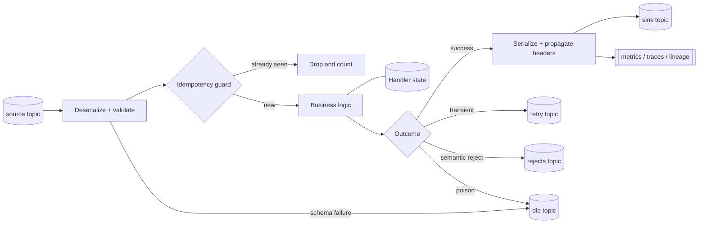
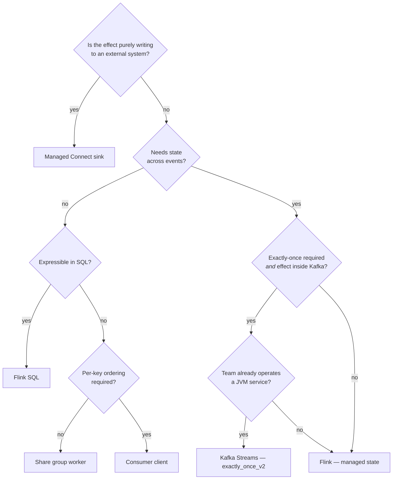

# Event Handler Substrate Selection

## Summary

An **event handler** is the smallest unit of business logic with a topic on either side — consume, decide, produce. Confluent Cloud offers five places to put that logic: Flink SQL/Table API, Kafka Streams, a plain consumer/producer client, a **share group worker** (KIP-932), and Connect + SMT. Choosing between them is an architecture decision driven by five questions — state, exactly-once, per-key ordering, operating model, and whether the effect lands inside or outside Kafka — not by which language the team likes. This article gives the decision procedure, the nine-part anatomy every handler shares regardless of substrate, and the disqualifiers that rule each substrate out. The two most commonly mis-made calls are putting business logic in a Connect SMT, and reaching for a share group where per-key ordering is actually required.

> **Validation status (confidence: medium).** The substrate inventory and the share-group constraints are MCP-backed via [Queues for Kafka (Share Groups)](../concepts/queues-for-kafka-share-groups.md) (validated 2026-06-09) and the runtime articles linked below. The selection procedure itself is field practice — a synthesis across those sources rather than a vendor-published decision tree.

## Pattern

### Scope — what is and is not a handler

**Is a handler:** logic that reads an event, makes a decision, and emits a result or an effect.

**Not a handler, but in scope as ingress/egress:** connectors. Kafka Connect moves data across the system boundary. An SMT doing a field rename is fine; an SMT encoding a business rule is a handler in the wrong place, untestable and invisible to lineage.

**Not in scope:** API gateways, batch jobs, and anything whose trigger is a clock rather than an event.

### The anatomy every handler shares

Nine parts, independent of substrate. A handler missing three of them is a finding, not a style preference.

The part that constrains everything downstream is the **effect**. If the effect is confined to Kafka, exactly-once is available. If it reaches an external system, it is at-least-once regardless of configuration — see [Exactly-Once Semantics](../concepts/exactly-once-semantics.md).

### The five substrates

| Substrate | Use it for | Disqualifier |
|-----------|-----------|--------------|
| **Flink SQL / Table API** | Stateless and windowed logic expressible declaratively; serverless, nothing to operate | Logic not expressible in SQL and not worth the Table API |
| **Kafka Streams** | Stateful JVM logic, `exactly_once_v2`, embedded state stores, interactive queries | Team unwilling to operate a JVM service |
| **Consumer / producer client** | Full control, non-JVM languages, custom effects | You are reimplementing Kafka Streams |
| **Share group worker** (KIP-932) | Competing consumers, per-record ack, parallelism **above** partition count | Per-key ordering or EOS required — neither is available |
| **Connect + SMT** | Ingress and egress only | Any real business decision |

### Selection procedure

Answer in order. The first disqualifying answer decides it.

The five questions in prose:

1. **Is the effect purely writing to an external system?** → managed Connect sink. Stop.
2. **Does it need state across events?** No → Flink SQL if expressible; otherwise a client.
3. **Does per-key ordering matter?** Yes → consumer group. **Never a share group.**
4. **Is exactly-once required, and is the effect inside Kafka?** Yes to both → Kafka Streams or Flink. Yes to the first, no to the second → EOS will not help; use at-least-once plus an idempotent effect.
5. **Who operates it?** Platform-operated → prefer Flink. App-team-operated → Streams or client.

### Share groups — the constraint that decides most cases

Share groups are GA on Confluent Cloud (Apache Kafka 4.2.0, February 2026) and are the most commonly misapplied entry on this list.

**What they buy:** parallelism decoupled from partition count, per-record acknowledgement, and no head-of-line blocking from one slow record.

**What they cost — non-negotiable:**
- **At-least-once only.** No exactly-once path exists. The handler must be idempotent.
- **No per-key ordering.** Records for the same key can be processed concurrently and out of order.

**Therefore:** a share group is a **work-distribution** substrate, not a state-machine substrate. Correct for independent units of work — enrichment lookups, notification fan-out, document processing. Wrong for ordered state transitions on an entity.

See [Queues for Kafka (Share Groups)](../concepts/queues-for-kafka-share-groups.md) for the acknowledgement model and config surface.

### Substrate implications downstream

Choosing the substrate also chooses several things people expect to decide later:

| Concern | Flink | Kafka Streams | Client | Share group |
|---------|-------|---------------|--------|-------------|
| EOS available | Yes | Yes (`exactly_once_v2`) | Yes (manual) | **No** |
| Per-key ordering | Yes | Yes | Yes | **No** |
| State ownership | Managed, checkpointed | RocksDB + changelog | Yours | N/A |
| DLQ | Native for source deser errors | Handler-implemented | Handler-implemented | Native reject |
| Tier-1 test tooling | SQL against fixed tables | `TopologyTestDriver` | Pure function | Pure function |
| Restore time on failover | Managed | **Your real RTO** | N/A | N/A |

## When to Use

- Starting any new event handler — this is the first decision, before schema and before code
- Reviewing an existing handler that is expensive, slow, or hard to test; the substrate is often the root cause
- Assessing whether a Connect SMT has accumulated business logic that belongs in a handler
- Evaluating whether an over-partitioned topic exists only to buy consumer parallelism a share group would now provide

## Caveats

- **Substrate migration is not free.** Moving a stateful handler between substrates means rebuilding state. Treat the initial choice as a two-year commitment, not a preference.
- **"Expressible in SQL" is a moving target.** Re-check the current CC Flink SQL surface via `confluent-docs` before ruling it out for a given transform.
- **Share groups are new in production terms.** The constraints above are documented and reliable; broad operational experience under load is not yet widely held. Pilot before standardising.
- **The decision tree assumes one handler, one job.** A component doing three unrelated things will not fit any branch cleanly — that is a decomposition signal.
- **Connect is disqualified for business logic, not for complexity.** A sophisticated managed connector configuration is still the right answer for pure ingress/egress.

## FSI Overlay

- **Frame the choice against the SLA tier first.** Sub-millisecond market data rules out substrates with managed scheduling; async reconciliation rarely justifies EOS at all. See [SLA Tiers](../concepts/sla-tiers.md).
- **Vendor-supported substrates only.** All five here are Confluent-supported under one contract, which is the point — see the vendor-consolidation rule in [FSI Data Streaming Platform](../concepts/fsi-data-streaming-platform.md).
- **Per-key ordering is frequently a regulatory requirement, not a preference** — ledger postings, order state transitions, position updates. Where ordering is regulatory, share groups are excluded and this must be recorded, not assumed.
- **Record the substrate and delivery guarantee per handler in the service manifest.** Auditors ask what the guarantee is; "Kafka Streams" is not an answer, "`exactly_once_v2`, Kafka-internal, with an idempotent external sink" is.
- **Mainframe-adjacent flows** land on the Connect ingress path — IBM MQ Source Connector → Kafka is the canonical bridge. See [LinuxONE Kafka Integration](../concepts/linuxone-kafka-integration.md).

## Related

- [Queues for Kafka (Share Groups)](../concepts/queues-for-kafka-share-groups.md) — the fifth substrate in full
- [Flink Runtime Models](flink-runtime-models.md) — choosing among Flink deployment shapes once Flink is selected
- [Kafka Streams Architecture](../concepts/kafka-streams-architecture.md) — threading and state model
- [Connect Deployment Models](connect-deployment-models.md) — the ingress/egress boundary
- [Event Handler Testing Strategy](event-handler-testing-strategy.md) — the substrate determines tier-1 tooling
- [Exactly-Once Semantics](../concepts/exactly-once-semantics.md) — why the effect location constrains the choice

---

*Diagram sources: `outputs/reports/event-handler-deck-art/` — anatomy as `svg/art-02-handler-anatomy.svg`, taxonomy grid as `svg/art-01-pattern-taxonomy.svg`.*
