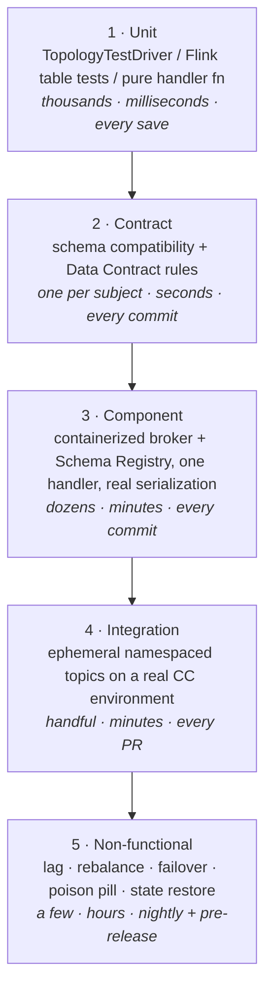

# Event Handler Testing Strategy

## Summary

Streaming teams reliably end up with an **hourglass** — a few unit tests, almost nothing in the middle, and a heavy layer of slow end-to-end tests against a shared cluster. The fix is structural, not disciplinary: separate deserialize / process / effect so the business logic is a pure function over a decoded record, and the cheap tiers become writable. This article defines five test tiers for event handlers — unit, contract, component, integration, non-functional — what belongs in each, and the five non-functional tests that catch the failures correctness tests never will. The **contract tier sits second, not last**: a schema compatibility check is the cheapest gate in the stack and prevents the most common cross-team incident in streaming, so it runs on every commit.

> **Validation status (confidence: medium).** Compiled from field practice and the Confluent testing surface (`TopologyTestDriver`, Schema Registry compatibility checks, ephemeral CC environments via Terraform). Tier-3/4 tooling choices are engineering judgement, not vendor-prescribed — no MCP-validated claim is made about specific test-harness products. Re-validate the Flink SQL testing surface against `confluent-docs` before treating §Tier 1 Flink guidance as canon.

## Pattern

### The five tiers

| Tier | Scope | Needs a broker? | Needs Confluent Cloud? |
|------|-------|-----------------|------------------------|
| 1 · Unit | One topology or one handler function | No | No |
| 2 · Contract | One schema subject | No (registry only) | Registry endpoint |
| 3 · Component | One handler, real serde | Yes (container) | No |
| 4 · Integration | Handler + managed services | Yes | Yes — ephemeral |
| 5 · Non-functional | Handler under stress/failure | Yes | Yes |

### Tier 1 — Unit: make the handler a pure function

The single structural decision that makes everything else cheap:

> Separate **deserialize → process → effect** so that `process` is a pure function over an already-decoded record.

Consequences:

- **No `KafkaConsumer` in a unit test.** If a unit test needs one, the seam is in the wrong place.
- **Kafka Streams** — `TopologyTestDriver` drives a topology with no broker: pipe input records, read output records, advance wall-clock time explicitly.
- **Flink SQL** — test the SQL as SQL against fixed input tables; assert on the result set.
- **Plain consumer/producer clients** — the handler function takes a decoded record and returns an outcome; the Kafka plumbing is not under test here.

Handlers that interleave I/O and logic push all of their tests to tier 4. That is the hourglass, and it is an architecture problem presenting as a testing problem.

### Tier 2 — Contract: the highest-ROI gate available

Two gates, not one. See [Schema Registry Best Practices](../concepts/schema-registry-best-practices.md) for why the distinction matters.

| Gate | Catches | Misses |
|------|---------|--------|
| **Compatibility check** vs the registry's current version | Structural incompatibility — removed required field, type change | Anything semantic |
| **Data Contract rules** (validation + domain constraints) | Field reused with new meaning, out-of-domain enum value, null in a field consumers assume populated | Logic errors |

Run both on every commit. A breaking change fails the pull request, not the deploy.

**Consumers declare the subject *and version* they read.** Without that, the blast radius of a schema change is discovered rather than computed.

### Tier 3 — Component: real serialization, one handler

A containerized broker plus Schema Registry, exercising exactly one handler end to end with **real serde**. This tier exists to catch what tier 1 structurally cannot:

- Serializer/deserializer configuration errors (wrong subject strategy, missing registry auth)
- Header propagation, including `traceparent`
- Actual partitioning behaviour from the chosen key
- DLQ and retry routing — see [Dead Letter Queue Design](dead-letter-queue-design.md)

### Tier 4 — Integration: ephemeral, namespaced, on real Confluent Cloud

Anything *managed* cannot be faked locally — Flink statements, managed connectors, RBAC behaviour, Data Contract rule enforcement. Test those against a real environment.

- Topics **namespaced per branch or per PR**, created and destroyed by Terraform in the same pipeline run
- Seed data from a datagen connector or a captured golden set
- Tear-down is part of the pipeline, not a cleanup cron

See [Terraform CI/CD with Confluent Private Networking](terraform-cicd-confluent-private-networking.md) for the provisioning surface.

### Tier 5 — The five tests nobody writes

Correctness tests pass, and then you deploy. These are where the incidents actually come from.

| Test | What it proves | Failure it prevents |
|------|----------------|---------------------|
| **Lag and backpressure at 3× peak** | The handler degrades predictably; watch lag's *derivative*, not its absolute value | Silent unbounded lag growth |
| **Rebalance on rolling restart** | Static membership and the cooperative assignor are actually configured | Rebalance storm on every deploy |
| **Broker / AZ failover and reconnect** | Client reconnect settings survive a real disconnect | Handler wedged after a transient network event |
| **Poison-pill injection** | The DLQ path works | Discovering the DLQ was never wired, at 2am |
| **State restore from cold** | How long a cold start actually takes | An RTO that is a guess |

**The state-restore number is not a test result — it is your RTO.** Record it, and re-measure when state size changes materially. See [DR Application Routing](dr-application-routing.md).

### Determinism and fixtures

> A flaky streaming test is usually an undeclared time dependency.

- **Pin the clock.** Drive watermarks manually rather than sleeping.
- **Seed everything** — no random IDs without a fixed seed.
- **Fixtures from captured production traffic**, masked and versioned in the repo. Synthetic data does not contain the shapes that break you.
- **Golden-file assertions** on output topics. Diff programmatically; do not eyeball.

Handlers that use processing time instead of event time cannot be made deterministic at all — see [Flink Event Routing](flink-event-routing.md) and the time-semantics discussion in [Flink on Confluent Cloud](../concepts/flink-confluent-cloud-setup.md).

## When to Use

- Standing up a new event-handler repo or a golden-path template — wire all five tiers in from the start
- Diagnosing a team whose test suite is slow, flaky, and still misses production defects (the hourglass signature)
- Defining the CI gate set for a streaming platform
- Any regulated workload where evidence of pre-production verification is an audit artifact

## Caveats

- **Tier counts are guidance, not a quota.** The shape matters — cheap tests numerous, expensive tests few — not a specific ratio.
- **Tier 4 costs real money and real cluster capacity.** Ephemeral environments must actually be destroyed; an orphaned per-PR namespace is a recurring bill and a governance finding.
- **`TopologyTestDriver` does not model rebalancing, network partitions, or multi-instance behaviour.** It verifies topology logic only. Tier 5 is where those live.
- **The Flink SQL testing surface is less mature than the Kafka Streams one.** Validate current capability against `confluent-docs` rather than assuming parity.
- **Contract tests protect the schema, not the semantics of your business rules.** Data Contract rules narrow the gap; they do not close it.

## FSI Overlay

- **Fixtures containing production data must be masked before they enter the repo.** Capture-and-mask is a pipeline step with an owner, not a developer convention. Pairs with the payload-isolation model in [Auditor Read-Only RBAC](auditor-readonly-rbac-payload-isolation.md).
- **Tier 5 evidence is an audit artifact.** Failover and restore tests should emit a dated, retained result — "we tested DR" without a record does not satisfy an examiner.
- **The contract gate is a control, not a convenience.** In regulated environments, describe it as a change-management control preventing unreviewed interface changes reaching production; that framing maps directly onto the CI/CD audit trail in [FSI Compliance](../concepts/fsi-compliance.md).
- **Exactly-once claims must be tested, not asserted.** If a handler is documented as exactly-once for regulatory reporting, tier 5 must include a duplicate-injection test. See [FSI Exactly-Once](fsi-exactly-once.md).

## Related

- [Event Handler Substrate Selection](event-handler-substrate-selection.md) — which substrate you chose determines which tier-1 tooling applies
- [Consumer Deployment Strategies](consumer-deployment-strategies.md) — shadow deployment is tier 5 run against production traffic
- [Dead Letter Queue Design](dead-letter-queue-design.md) — the poison-pill test target
- [Schema Registry Best Practices](../concepts/schema-registry-best-practices.md) — the two contract gates
- [Kafka Streams Debugging](../concepts/kafka-streams-debugging.md) — what to do when a tier-5 test fails
- [FSI Canon Overlay for Confluent Skills](fsi-canon-overlay-for-confluent-skills.md) — upstream skill defaults this overlays

---

*Diagram source: `outputs/reports/event-handler-deck-art/` — tier pyramid as `svg/art-09-test-pyramid.svg` for slide and document reuse.*
