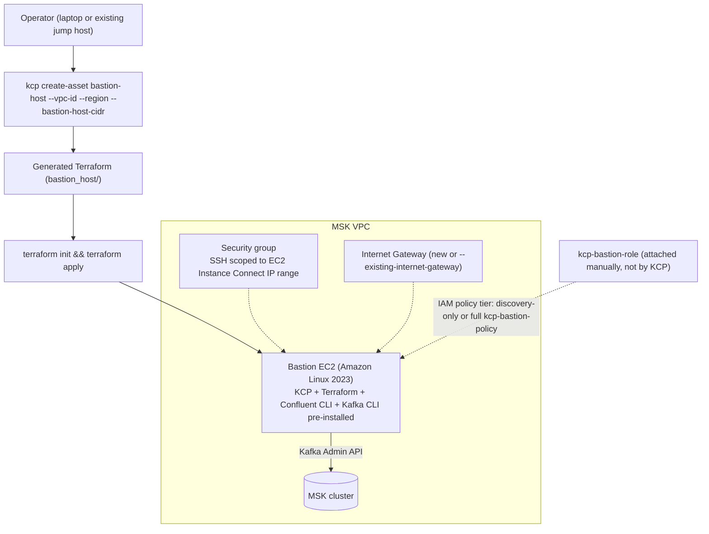
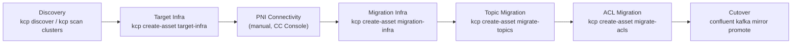

# KCP (Copy Paste) — Quick Bastion Host Provisioning and MSK-to-CC Migration

## Summary

**Copy Paste (kcp)** — confirmed as the official name via `docs.confluent.io`
(the page title is literally "Migrate Clusters with the Copy Paste (kcp)
Tool"; some hand-written notes in the wild instead gloss it as "Kafka Cloud
Provisioner," which is not the documented name) — is Confluent's CLI for
migrating Apache Kafka deployments (AWS MSK, or any Kafka-API-compatible
source) to Confluent Cloud. Its most frequent real-world use here is not the
full multi-stage migration — it's the standalone `kcp create-asset
bastion-host` command, used to stand up a disposable, fully pre-installed
EC2 (KCP, Terraform, Confluent CLI, Kafka CLI) inside the source MSK VPC in
minutes, without hand-provisioning a jump box. Everything KCP generates is
Terraform — nothing is provisioned until `terraform apply` runs.

## Pattern

### Why a bastion host is needed at all

MSK clusters almost always sit on a private-network VPC. Confluent's own docs
confirm: for private-network clusters, `kcp` must run from a bastion host or
jump server inside the same VPC — the AWS management API alone (which is
reachable from anywhere) is not enough, because discovery/scan/migration
stages need direct Kafka Admin API access to the brokers themselves. If you
don't already have a jump host in that VPC, `kcp create-asset bastion-host`
provisions one for you.

### Quick-provision architecture (the primary use case)



### Standing up the bastion

```bash
kcp create-asset bastion-host \
  --region us-east-1 \
  --vpc-id vpc-xxxxxxxx \
  --bastion-host-cidr 10.0.255.0/24 \
  --existing-internet-gateway \
  --output-dir bastion_host

cd bastion_host && terraform init && terraform apply
terraform output   # bastion_host_public_ip
```

`--existing-internet-gateway` is required in almost every real VPC — default
and most existing VPCs already have an IGW attached, and the command fails
("IGW already attached") if you omit the flag and let it try to create a new
one.

The generated Terraform provisions: an Amazon Linux 2023 EC2 in a new public
subnet; an RSA-4096 SSH key pair written locally (`.ssh/migration_rsa`); a
security group whose SSH ingress is scoped to AWS's own **EC2 Instance
Connect** IP range (fetched live from `ip-ranges.amazonaws.com` for the
target region, not opened to `0.0.0.0/0`) plus an explicit CIDR/SG rule from
`--security-group-ids`; and route table/IGW wiring. If `--security-group-ids`
is passed, KCP skips creating its own SG entirely and reuses the ones given —
useful when your environment already has an approved SG for migration hosts.

> ⚠️ unverified — KCP's own default-generated IAM role for the bastion
> attaches AWS-managed `PowerUserAccess` plus a broad inline `iam:CreateRole`/
> `iam:*Policy*` statement (so later `create-asset` stages can self-provision
> IAM without extra steps). This is convenience-first, not least-privilege;
> confluent-docs does not publish or endorse a specific bastion IAM policy,
> so treat this as an observed default to tighten, not a documented baseline.

### Two-hop pattern when a jump host already exists

If a jump host already exists in the MSK VPC, install the `kcp` binary there
first, then run `kcp create-asset bastion-host` **from** that jump host to
get a clean, dedicated, pre-installed migration EC2 — instead of hand
installing Terraform/Confluent CLI/Kafka CLI onto the existing jump host
directly. SSH to the new bastion happens from the jump host, so port 22 never
needs to be opened externally:

```bash
ssh -i bastion_host/.ssh/migration_rsa ec2-user@<bastion-public-ip>
```

With no existing jump host, run the same command from your own laptop
against AWS credentials with EC2/IAM create permissions, and open SSH only to
your current IP:

```bash
curl -s https://checkip.amazonaws.com
aws ec2 authorize-security-group-ingress \
  --region <region> --group-id <bastion-sg-id> \
  --protocol tcp --port 22 --cidr <your-ip>/32
```

### IAM policy tiers (KCP does not attach any of these for you)

| Tier | Covers | Key statements |
|---|---|---|
| Discovery-only | `kcp discover`, `kcp scan` | `MSKDiscovery` (`kafka:List*`/`Describe*`/`Get*`) — matches the AWS-API permissions confluent-docs documents for `kcp discover`. Add IAM-auth `kafka-cluster:Connect/DescribeCluster/DescribeTopic/DescribeGroup` only if MSK auth is IAM (SCRAM/mTLS clusters use a credentials file instead, no extra IAM needed) |
| Full `kcp-bastion-policy` | `create-asset bastion-host`, `migration-infra`, topic/ACL/schema/connector migration | Adds `EC2ReadOnly` plus per-resource EC2 management (subnet, SG, route table, instance, key pair, NAT gateway, IGW), `iam:PassRole` scoped to the bastion role, optional `GlueSchemaRegistry` |
| Connector migration add-on | Stage 08 only | `kafkaconnect:CreateConnector`/etc., S3 access to the plugin bucket, `iam:PassRole` to a separate MSK Connect execution role (conditioned on `iam:PassedToService = kafkaconnect.amazonaws.com`) |

> ⚠️ unverified — the exact EC2/IAM action lists in the full `kcp-bastion-policy`
> tier reflect iterative hardening (adding exactly the action
> that failed on `AccessDenied` during `terraform apply`), not an officially
> published minimum-permission set. `confluent-docs` only documents the
> discovery-tier statements.

If port 22 is blocked entirely, attach the AWS-managed
`AmazonSSMManagedInstanceCore` policy instead and use
`aws ssm start-session --target <instance-id>`.

### The full pipeline (what the bastion feeds into, when used)



Discovery inventories topics/ACLs/consumer groups into a state file; target
infra provisions the destination CC Enterprise cluster; PNI connectivity is a
manual CC Console step (Confluent injects managed ENIs into VPC subnets,
requiring wildcard DNS records pointed at them); migration infra stands up
jump-cluster brokers that Ansible wires into two automatic cluster links (MSK
→ Jump via IAM/port 9098, Jump → CC via SASL/PLAIN over PNI); topic migration
creates continuously-replicating CC mirror topics; ACL migration converts
each MSK principal into a CC service account + role binding (with an audit
report for review before apply); cutover promotes mirror topics, preserving
consumer offsets so clients resume with no replay. Schema and connector
migration are optional side stages. Client-side cutover itself can be handled
via [Confluent Cloud Gateway](../concepts/confluent-gateway.md) for a
zero-config-change switchover — confirmed as a documented KCP integration
point, not just a roadmap item.

### Cleanup (reverse order)

Stop producer/consumer on the bastion → delete the MSK cluster → `terraform
destroy` in `migration-infra` → `terraform destroy` in `target-infra`
(**destroys all CC topics/data — confirm cutover first**) →
`migrate-schemas`/`migrate-acls` destroy → destroy the bastion's own output
dir → delete any Glue registry/schema created for testing → delete Route53
private hosted zones created for PNI → sweep orphaned subnets/SGs/key
pairs/EIPs (NAT gateway EIPs bill hourly if missed) → remove the temporary
MSK security-group rule opened for the jump cluster on port 9098 →
detach/delete the bastion IAM role/policy/instance profile → delete the CC
Console PNI gateway.

## When to Use

- You need fast, throwaway access to a Kafka cluster inside a private VPC
  (most MSK clusters) without hand-configuring a jump box — `kcp create-asset
  bastion-host` on its own, independent of running any other migration stage.
- You're running an actual MSK → Confluent Cloud migration and need the
  bastion as the first infrastructure step before discovery/scan can reach
  the brokers.
- Your environment already has an approved jump host — use the two-hop pattern
  (install `kcp` there, generate a dedicated bastion from it) rather than
  polluting the existing host with migration tooling.

## Caveats

- KCP never attaches an IAM role/instance profile to the bastion for you —
  that's always a manual `aws iam create-role`/`attach-role-policy` step
  before running any `kcp` command from the host.
- KCP's own default-generated bastion IAM role is broad
  (`PowerUserAccess` + self-service IAM management) — tighten it per the
  tiered policies above if your environment has any least-privilege
  requirement.
- `kcp discover` against a SCRAM-authenticated MSK cluster will attempt
  IAM-based topic listing and get a 403 — expected, not a misconfiguration;
  topic detail fills in later during `kcp scan clusters` via the credentials
  file.
- Internal MSK topics (`__consumer_offsets`, `__amazon_msk_canary`) can't be
  scoped to individual ARNs in a tightened topic-access policy — they need
  the `/*` wildcard or a dedicated `DescribeTopicDynamicConfiguration`
  statement.
- `iam:PassRole` is required for `kafkaconnect:CreateConnector` even when
  every `kafkaconnect:*` action is already granted — connector creation
  fails silently without it.
- `--existing-internet-gateway` should be passed for essentially every real
  VPC; omitting it on a VPC that already has an IGW fails the apply.

## Related

- [DR — Cluster Linking](dr-cluster-linking.md) — the same mirror-topic
  mechanism KCP's `migration-infra`/`migrate-topics` stages wire up is
  Confluent's standard active-passive DR primitive
- [Cluster Linking Topology](../concepts/cluster-linking-topology.md) —
  background on mirror topics, offset preservation, and promotion semantics
- [Private Networking — PrivateLink Gateway, PNI, Peering, TGW](../concepts/confluent-cloud-private-networking.md) —
  the PNI gateway/ENI/wildcard-DNS mechanics behind KCP's Stage 03
- [Confluent Gateway — Protocol-Aware Kafka Proxy](../concepts/confluent-gateway.md) —
  the client-switchover mechanism KCP's migration flow points to for cutover
- [YAML-Driven Topic & RBAC Admin Tooling for Confluent Platform](yaml-topic-rbac-admin-tool.md) —
  a comparable principal-to-role-binding migration tool, for CP rather than MSK→CC
