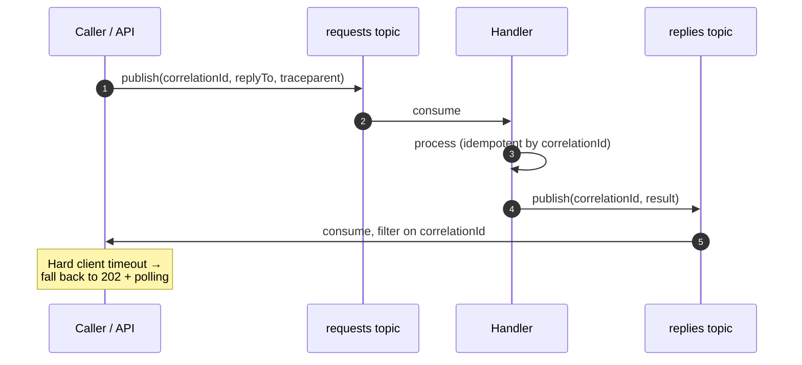

# Request–Reply over Kafka

## Summary

Request–reply over Kafka is legal, occasionally correct, and usually the wrong instinct — but teams will build it regardless, so codify it once rather than getting five inconsistent implementations. The mechanics are a correlation ID on the request, a reply-to topic in a header, consumer-side filtering on the correlation ID, and a **hard client timeout**. The architectural advice that matters more than the mechanics: prefer `202 Accepted` plus polling, or a server-sent completion, over holding an HTTP thread open waiting for a Kafka round trip. If you find yourself building this more than twice, the real question is whether the interaction is genuinely synchronous and belongs behind an API instead.

> **Validation status (confidence: medium).** Vendor-neutral pattern; no Confluent-published request–reply reference is asserted. Latency characteristics depend heavily on client tuning — see [Latency-Optimized Kafka Client](latency-optimized-kafka-client.md) for the MCP-validated tuning surface.

## Pattern

### The four mechanics

| Element | Rule |
|---------|------|
| **Correlation ID** | Generated by the caller, carried in a header, echoed unchanged on the reply. Also the handler's idempotency key. |
| **Reply-to topic** | In a header, not hardcoded in the handler. The handler publishes wherever it is told. |
| **Consumer-side filtering** | The caller consumes the reply topic and discards records whose correlation ID it is not waiting for. |
| **Hard client timeout** | Always. A request–reply with no timeout is a thread leak with extra steps. |

### Reply topic topology — pick deliberately

| Shape | Pros | Cons |
|-------|------|------|
| **One shared reply topic, all callers** | Simple, few topics | Every caller reads every reply and discards most. Wasteful at scale, and a confidentiality question in regulated contexts |
| **One reply topic per caller instance** | No wasted reads | Topic sprawl; instances are ephemeral, topics are not |
| **One reply topic per caller *service*, partitioned by correlation ID** | Bounded topic count, filtering mostly handled by partition assignment | Requires caller instances to coordinate partition ownership |

**Default to per-service.** Per-instance topics do not survive contact with autoscaling.

### Timeout and fallback

The timeout is a product decision, not a config default, and it should be shorter than the caller's own SLA budget. On expiry:

1. Stop waiting. Release the thread.
2. Return `202 Accepted` with the correlation ID.
3. Let the caller poll a status endpoint, or push completion over SSE/WebSocket.

**The reply may still arrive.** The handler does not know the caller gave up. The status endpoint must be able to serve a result that landed after the timeout — which means the result is persisted, not just published.

### Why this is usually the wrong instinct

Kafka's strengths — durability, replay, fan-out, decoupling — are all irrelevant to a synchronous call, while its costs — partition assignment, rebalance sensitivity, consumer lag, at-least-once delivery — all apply. A synchronous call over an asynchronous log inherits every operational property of the log with none of the benefits.

**Legitimate reasons to do it anyway:**
- The handler already exists as a Kafka consumer and adding an HTTP surface duplicates it
- The request must be durably recorded regardless of whether the caller is still listening
- Governance requires that every request traverse the audited streaming path
- The backend genuinely cannot expose a synchronous endpoint (mainframe-fronted, MQ-bridged)

**Illegitimate reason:** "we are an event-driven organisation." That is a slogan, not a requirement.

## When to Use

- A synchronous-looking interaction whose backend is already a Kafka handler
- Requests that must be durably recorded before processing, independent of caller liveness
- Where an audit trail of every request is a governance requirement
- Fronting a system reachable only via the streaming path — see [LinuxONE Kafka Integration](../concepts/linuxone-kafka-integration.md)

**Do not use it** to make an ordinary API call event-driven. Use an API.

## Caveats

- **Rebalance kills in-flight waits.** If the caller's reply consumer rebalances, replies in the reassigned partitions go to a different instance — which is not the one holding the waiting request. Static membership mitigates this; see [Consumer Group Rebalancing](../concepts/consumer-group-rebalancing.md).
- **The caller must be a *stable* consumer.** Creating a consumer per request is a rebalance storm generator. Use one long-lived consumer per instance with an in-memory correlation map.
- **At-least-once means duplicate replies.** The handler must be idempotent by correlation ID, and the caller must tolerate a second reply arriving.
- **Latency has a floor set by client tuning**, not by Kafka. `linger.ms`, `fetch.min.bytes`, and `fetch.max.wait.ms` dominate. See [Latency-Optimized Kafka Client](latency-optimized-kafka-client.md).
- **Shared reply topics leak.** Every caller can read every reply. In regulated contexts this is a data-access finding, not a design preference.
- **Correlation maps are memory.** A caller holding thousands of in-flight correlations with a long timeout has an unbounded map. Bound it and evict on timeout.
- **DLQ'd requests produce no reply at all.** The caller times out with no signal about why. Emit a failure reply from the error path rather than letting it fall silent — see [Dead Letter Queue Design](dead-letter-queue-design.md).

## FSI Overlay

- **Shared reply topics are usually disqualified.** Where replies contain customer or position data, per-service reply topics with RBAC scoping are the minimum; a shared topic means every caller service is authorised to read every other's results.
- **Timeout budgets come from the SLA tier.** A <10ms risk-tier interaction is almost certainly not a Kafka request–reply; a <100ms compliance query might be. See [SLA Tiers](../concepts/sla-tiers.md).
- **The request topic is the audit record.** That is frequently the actual justification for this pattern in regulated environments — retention on the request topic must then match the audit requirement, not the operational one.
- **A timed-out request that later succeeds is a reconciliation obligation.** The caller returned `202` and moved on; something must reconcile the eventual result. Design that path, do not discover it.
- **Correlation IDs should not encode business data.** A correlation ID containing an account number leaks it into headers, logs, and lineage tooling.

## Related

- [Event Handler Substrate Selection](event-handler-substrate-selection.md) — whether this belongs on Kafka at all
- [Saga / Process Manager](saga-process-manager.md) — the command/reply mechanics used between saga participants
- [Latency-Optimized Kafka Client](latency-optimized-kafka-client.md) — what sets the latency floor
- [Consumer Group Rebalancing](../concepts/consumer-group-rebalancing.md) — why the reply consumer must be stable
- [Topic Naming](topic-naming.md) — request and reply topic naming
- [SLA Tiers](../concepts/sla-tiers.md) — whether the tier permits this at all

---

*Diagram source: `outputs/reports/event-handler-deck-art/svg/art-05-request-reply.svg`.*
