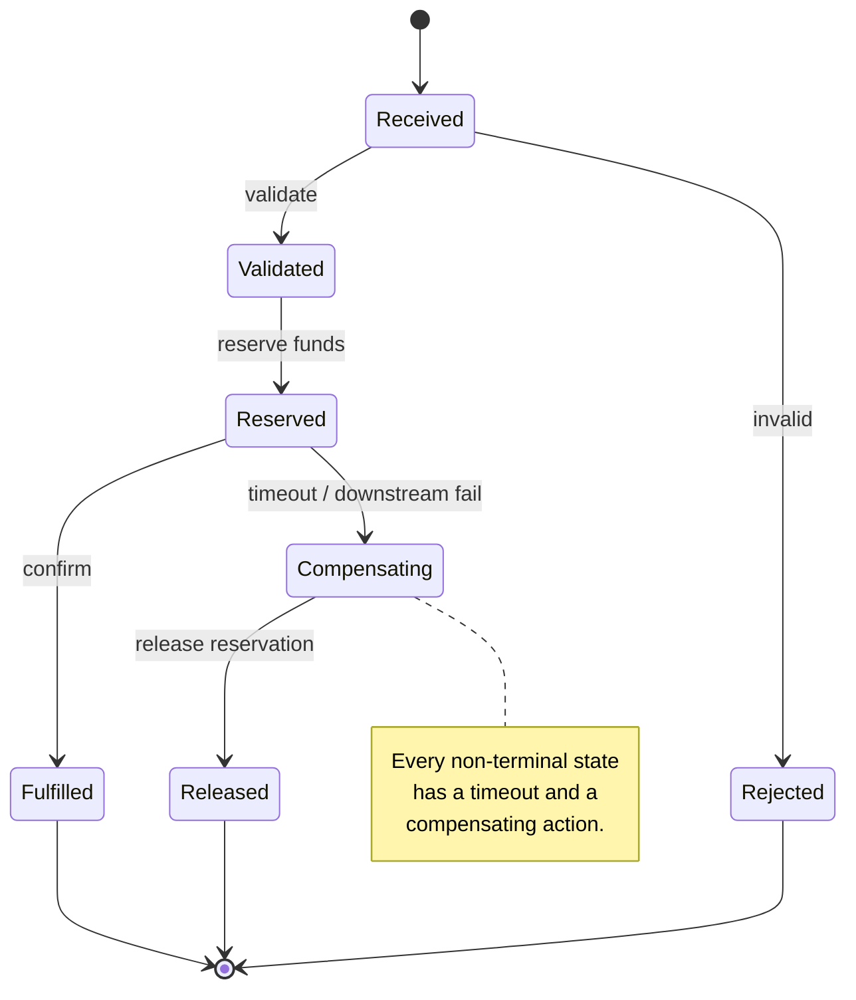

# Saga / Process Manager

## Summary

A multi-step business process that spans services cannot use a distributed transaction, so it uses a **saga**: a sequence of local transactions where each step has a **compensating action** that undoes it. The choice that matters is *orchestration versus choreography* — an explicit state machine that owns the process, versus a chain of handlers each reacting to the previous one's output. **Prefer orchestration.** A saga implemented as an implicit chain of topics is a distributed system with no owner and no diagram; when it breaks at 3am nobody can say what state anything is in. The three non-negotiables: every non-terminal state has a **timeout**, every non-terminal state has a **compensating action**, and the state machine is a first-class artefact in the repo that **gets its own tests**.

> **Validation status (confidence: medium).** The saga pattern is vendor-neutral and long-established (Garcia-Molina & Salem, 1987). This article's Kafka-specific guidance builds on [Exactly-Once Semantics](../concepts/exactly-once-semantics.md), which names saga orchestration as one of the three answers to the Kafka-internal EOS boundary. Not MCP-validated — no Confluent-published saga reference is asserted.

## Pattern

### Orchestration over choreography

| | Orchestration | Choreography |
|---|---|---|
| Process state | Held explicitly by one process manager | Implicit, spread across handlers |
| "What state is order X in?" | Query the state machine | Reconstruct from several topics |
| Adding a step | Edit one state machine | Edit N handlers, hope you found them all |
| Compensations | Enumerated in one place | Each handler must know what to undo |
| Coupling | Manager knows the participants | Participants know each other implicitly |
| Best for | Anything with money, compliance, or >3 steps | Simple, stable, 2–3 step flows |

Choreography is not wrong — it is right for short, stable flows where the coupling genuinely is local. It becomes wrong quietly, as steps accumulate.

### The state machine

### The three requirements

**1. Every non-terminal state has a timeout.** A saga stuck in `Reserved` because a downstream service never replied is the single most common saga failure. The timeout is what converts an indefinite hang into a compensation.

**2. Every non-terminal state has a compensating action.** Compensations are *semantic*, not transactional rollbacks — you do not un-charge a card, you issue a refund. Write down what "undo" means for each step in business terms, because it is a product decision.

**3. The state machine is a tested artefact.** It is code with its own unit tests covering: every transition, every timeout path, every compensation, and the terminal-state exhaustiveness check. This is tier-1 testing — see [Event Handler Testing Strategy](event-handler-testing-strategy.md).

### Implementation on Confluent Cloud

| Concern | Approach |
|---------|----------|
| Substrate | **Kafka Streams** — the saga is stateful and needs per-instance ordered state. Flink is viable where the machine is expressible declaratively; a share group is **excluded** (no per-key ordering) |
| State | Keyed by the saga's correlation ID — one saga instance per key, which is what preserves ordering |
| Timeouts | Punctuator (Streams) or timer (Flink). **Not** an external scheduler polling a table |
| Commands out | A command topic per participant, or request–reply — see [Request–Reply over Kafka](request-reply-over-kafka.md) |
| Replies in | A single reply topic keyed by correlation ID |
| Failed compensations | Route to a DLQ with the saga ID and current state — a failed compensation needs a human |

**Key by the correlation ID.** The saga's ordering guarantee comes from partition ordering on that key. Getting this wrong means two events for the same saga processed concurrently on different instances, which corrupts the state machine silently.

### Compensations are not rollbacks

| Forward action | Compensation |
|---|---|
| Reserve inventory | Release reservation |
| Authorise payment | Void authorisation |
| Capture payment | Issue refund |
| Send notification | Send correction notification (you cannot unsend) |
| Post to ledger | Post reversing entry |

The last two rows are the point: some effects are irreversible, and the compensation is a *new* business event. Design them as such — see the corrections-as-events discussion in [Consumer Deployment Strategies](consumer-deployment-strategies.md).

## When to Use

- A business process spanning three or more services or bounded contexts
- Any flow where partial completion has a financial or regulatory consequence
- Where "what state is this in?" is a question the business asks and currently nobody can answer
- Replacing a chain of handlers that has grown past its original two steps

**Do not use it** for a two-step flow that is stable and has no compensation semantics. The state machine is real overhead; a simple handler chain is correct until it is not.

## Caveats

- **Sagas are not atomic and never will be.** There is an observable window where the process is partially applied. The business must accept that window; if it cannot, the boundary is wrong and the steps belong in one transactional service.
- **Compensation can fail.** Plan for it explicitly — it is the case that produces a stuck saga and a manual remediation queue. Instrument stuck-saga count as a first-class metric.
- **Timeouts must exceed the slowest realistic downstream response**, or you compensate a step that was actually going to succeed, and then it succeeds anyway. Now you have both.
- **EOS does not save you.** Kafka's transactional guarantees are Kafka-internal; a saga exists precisely because the effects are external. See [Exactly-Once Semantics](../concepts/exactly-once-semantics.md) §Kafka-internal scope.
- **State growth is unbounded without terminal-state cleanup.** Completed sagas must be evicted; a saga store that only grows is a restore-time problem later — see [Kafka Streams Production Hardening](../concepts/kafka-streams-production-hardening.md).
- **Idempotent participants are a precondition, not a nicety.** A retried command must not double-apply.

## FSI Overlay

- **The state machine is a compliance artefact.** Regulators ask what states a payment can be in and what happens in each. An explicit, versioned state machine answers that; a chain of handlers does not.
- **Every compensation needs an audit trail entry.** A reversing ledger entry is itself a reportable event with its own retention requirement.
- **Stuck sagas are a reportable operational risk**, not just an engineering backlog item. Alert on them by age, with a named owner and an SLO — the same discipline as the DLQ in [Dead Letter Queue Design](dead-letter-queue-design.md).
- **Reconciliation-tier flows** (async, per [SLA Tiers](../concepts/sla-tiers.md)) are the natural home for saga-based orchestration; sub-10ms risk paths are not.
- **Mainframe participants** are frequently non-idempotent and slow to compensate. Where a saga step reaches z/OS via MQ, the timeout and compensation design must reflect the actual response envelope — see [LinuxONE Kafka Integration](../concepts/linuxone-kafka-integration.md).

## Related

- [Exactly-Once Semantics](../concepts/exactly-once-semantics.md) — why sagas exist: the Kafka-internal boundary
- [Transactional Outbox](transactional-outbox.md) — how a saga participant emits its events reliably
- [Request–Reply over Kafka](request-reply-over-kafka.md) — the command/reply mechanics
- [Kafka Streams Topology Patterns](kafka-streams-topology-patterns.md) — the primitives the state machine is built from
- [Event Handler Testing Strategy](event-handler-testing-strategy.md) — the state machine gets its own tests
- [FSI Exactly-Once](fsi-exactly-once.md) — regulated-context guarantee framing

---

*Diagram source: `outputs/reports/event-handler-deck-art/svg/art-04-saga.svg`.*
