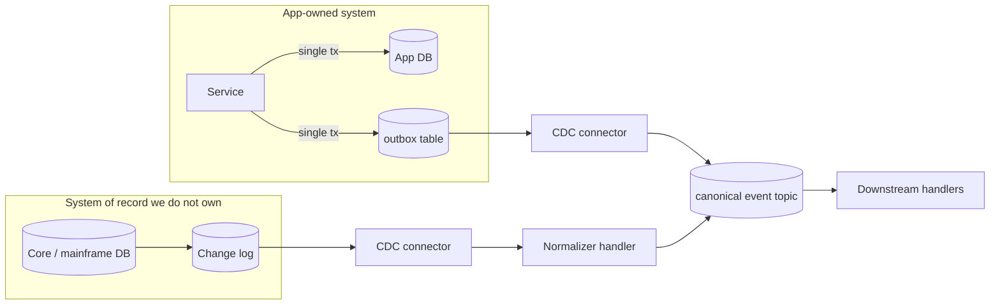

# Transactional Outbox and CDC Ingress

## Summary

Writing to your database and then publishing to Kafka is a **dual write** — two operations that can partially fail — and it is the most common correctness bug in event-driven systems. No retry strategy fixes it, because the failure mode is a successful database commit followed by a failed publish, leaving the system permanently inconsistent with no error anywhere. There are two correct patterns and the choice between them is ownership: the **transactional outbox** for data your application owns (write the business row and the outbox row in one local transaction; CDC publishes from the outbox), and **plain CDC** for systems you do not own (capture the change log directly). Both converge on the same downstream handler contract — which is the point, because a downstream handler should neither know nor care which produced its input.

> **Validation status (confidence: medium).** The dual-write problem and both patterns are vendor-neutral and long-established. Connector-specific behaviour is covered by the MCP-validated articles linked below ([CDC Source Connector Setup](../concepts/cdc-source-connector-setup.md), [Connect Deployment Models](connect-deployment-models.md)). This article is the pattern-level synthesis; validate connector configuration against those.

## Pattern

### Why dual writes cannot be fixed

```
1. BEGIN; INSERT order; COMMIT;     ✅ committed
2. producer.send(OrderCreated)      ❌ fails / times out / process dies
   → order exists, event never emitted, nothing knows
```

Reversing the order is worse — you emit an event for an order that then fails to commit. Retrying step 2 does not help when the process dies between them. Wrapping both in an application-level "transaction" is not a transaction. **The only fix is to make the two writes one write.**

### The two shapes



| | Transactional outbox | Plain CDC |
|---|---|---|
| Use when | You own the schema and the write path | You do not own the system |
| Event shape | **You design it** — a real domain event | Whatever the table looks like |
| Coupling | Downstream sees your published contract | Downstream sees someone's schema |
| Schema change risk | Controlled — outbox is a published interface | A DBA can break you without knowing |
| Extra work | An outbox table and a cleanup job | A normalizer handler |

**Prefer the outbox where you own the write path.** Its decisive advantage is that the event is *designed* rather than inferred: table columns are an implementation detail, and exposing them as an event contract couples every downstream consumer to your storage schema.

### Outbox mechanics

The outbox row carries the event, not a pointer to it:

| Column | Purpose |
|---|---|
| `id` | Primary key; also the natural dedup key downstream |
| `aggregate_type` / `aggregate_id` | Routes to a topic and supplies the message key |
| `event_type` | Maps to the schema subject |
| `payload` | The event body, already in its published shape |
| `created_at` | Ordering and lag measurement |

- **Write both rows in one local transaction.** That is the entire mechanism.
- **`aggregate_id` becomes the Kafka message key** — which makes it the ordering domain. See [Topic Naming](topic-naming.md).
- **Clean up published rows.** An outbox that only grows becomes a database problem. Delete-after-publish or partition-and-drop.
- **The outbox is at-least-once.** A connector restart can re-publish. Downstream must be idempotent — which is the same requirement everything else here has.

### CDC ingress and the normalizer

For systems you do not own, capture the change log and then **land raw, normalize downstream** — the [raw → derived](flink-event-routing.md) shape:

```
core DB → CDC connector → raw.<domain>.<app>.v1.<entity> → Flink normalize → canonical event topic
```

This preserves the raw capture as ground truth, decouples consumers from the source schema, and makes the normalization logic replayable. The alternative — normalizing inside an SMT — buries business logic in the connector where it cannot be tested. See [Event Handler Substrate Selection](event-handler-substrate-selection.md) on the Connect boundary.

For the CDC-to-lakehouse variant specifically, see [CDC to Tableflow — Flink Decode](cdc-to-tableflow-flink-decode.md).

### Both converge on one contract

The design goal: a downstream handler cannot tell which path produced its input. Same schema subject, same key semantics, same headers. When that holds, a system can migrate from CDC to outbox — the usual direction as ownership is established — without touching consumers.

## When to Use

- **Outbox:** any service that owns its data and must publish events about state changes
- **CDC:** systems of record you cannot modify — core banking, mainframe-fronted stores, vendor packages
- Anywhere you find `save(); publish();` in application code
- Migrating a legacy integration off nightly batch extracts

**Do not use the outbox** where the service does not own a transactional store, or where the event is not tied to a state change (a pure command or query has nothing to be transactionally consistent with).

## Caveats

- **The outbox adds write amplification and latency.** Two rows per business operation, plus CDC polling or log-reading lag. Usually small; measure rather than assume.
- **Outbox cleanup is not optional.** Unbounded growth degrades the source database — the system you were protecting.
- **Ordering is per key, not global.** Two aggregates' events can interleave arbitrarily. If a downstream consumer needs cross-aggregate ordering, the outbox will not give it.
- **CDC exposes deletes and soft-deletes differently**, and tombstone semantics surprise people. Confirm against [CDC Source Connector Setup](../concepts/cdc-source-connector-setup.md).
- **Source-connector duplicates are the default.** Connect is at-least-once unless EOS source (KIP-618) is enabled; the preferred answer is an idempotent consumer. See [Connect Deployment Models](connect-deployment-models.md).
- **Replication-slot hygiene on Postgres.** A Debezium connector without `heartbeat.interval.ms` will let the WAL grow until the disk fills. This is a recurring production incident, not an edge case.
- **Oracle has connector-specific limitations** worth reading before committing — see [Oracle XStream Source Limitations](../concepts/oracle-xstream-source-limitations.md).

## FSI Overlay

- **Dual writes are an auditability defect, not just a correctness one.** An event stream that silently misses records cannot support regulatory reporting, and the gap is undetectable after the fact. Where a stream feeds a regulatory report, the outbox (or CDC) is mandatory, not preferred.
- **The outbox table inherits the source system's data classification.** It contains the payload, so PII controls, encryption, and retention apply to it identically. It is frequently missed in data-mapping exercises.
- **CDC on a system of record needs the record owner's sign-off**, and often a documented performance impact assessment. Log-based capture is low-impact but not zero-impact.
- **Mainframe ingress** follows the CDC branch with IBM MQ Source Connector → Kafka as the canonical bridge. See [LinuxONE Kafka Integration](../concepts/linuxone-kafka-integration.md).
- **Saga participants should emit via an outbox.** A saga step that dual-writes reintroduces exactly the inconsistency the saga exists to manage — see [Saga / Process Manager](saga-process-manager.md).

## Related

- [Exactly-Once Semantics](../concepts/exactly-once-semantics.md) — the outbox as one of three answers to the Kafka-internal boundary
- [Saga / Process Manager](saga-process-manager.md) — how participants emit reliably
- [Connect Deployment Models](connect-deployment-models.md) — connector operation and DLQ configuration
- [CDC Source Connector Setup](../concepts/cdc-source-connector-setup.md) — connector-level configuration
- [Flink Event Routing](flink-event-routing.md) — the raw → derived shape the normalizer follows
- [CDC to Tableflow — Flink Decode](cdc-to-tableflow-flink-decode.md) — the lakehouse variant

---

*Diagram source: `outputs/reports/event-handler-deck-art/svg/art-08-outbox-cdc.svg`.*
